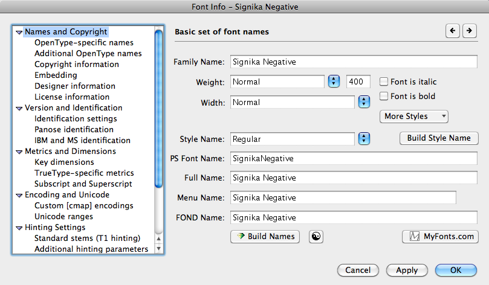

# Introduction

_Tutorial on generating font files for basic web use, using Fontlab and Fontforge._

This document by @davelab6 describes to font designers how to prepare a font file for delivery to Google Web Fonts (using only Fontlab.)

After sending the FontLab VFB files to me, I will further process them in FontForge. 
I describe my process in the page HowToGenerateWebNativeFontsWithFontForge which you may be interested in.

# Design Considerations

When designing a web font, to ensure the optical size is conventional, the maximum total glyph height (from lowest point in the family to highest point in the family) should be no more than 125% of the UPM. Eg, 1,250. 
Generally we need the UPM to be 1,000.

Try to avoid strokes that go left of the origin (0 on the X axis) since they may be 'clipped' in some web pages - especially in Swash Cap fonts. 
Since Caps are often used either at the start of a word or all together, if you space your caps normally and then shift them and their right side bearing ALL to the right by the SAME amount, you will find that they clip less when starting a line, but look okay when used to Start Words inside sentences (the preceding word space will be a little wider than usual and this is often imperceptible), and they will also work as normal in all caps settings because they are all shifted by the same amount. 
Thanks to Victor Gaultney for suggesting this technique.

Counters and apertures should not be too small, very fine details should not be too fine, because they will not appears on most computer screens.

Thin strokes should not be as thin as is normal in print fonts. 
[Pinyon Script](http://www.google.com/webfonts/specimen/Pinyon+Script) is a good example of how a high contrast font can be developed specifically for the web, with thins that are not too thin.

# How to Build a Single Font File

These instructions are for the typical GWF single style display type. 
If you have developed a set of styles, perhaps with FontLab's Multiple Master technology, you may have additional source files that must be included in the delivery (such as the MM master drawings.) Please email me to confirm the details.

Open X11 and go to the X11 application menu and then Preferences and in the Pasteboard section tick all the boxes

Take your source VFB, the one that you actually used to draw the font with that includes overlaps, components, and so on, plus any other files you used to create the font specific to this font, and rename it.

The GWF backend system requires there to always be a Regular (400) style in a family. 
If your font is not such a font, and we publish it as "Fontname" then this presents a potential problem in the future, where the Google Web Fonts team wants to commission more weights (up to 9 are allowed on the web, 100, 200, ... 900) and the weights don't make 'logical' sense.

We already ran into this problem where fonts are initially published with their 'true' family name but not  with a 'true' Regular Roman style - Lobster, for example, it really a Bold Italic style. 
To resolve this, we decided to publish the family as "Lobster Two" - which is not ideal. 
Eventually when the character set of Lobster Two is expanded to match that of the single style Lobster, then the "Lobster" family will be de-listed. 
(It will continue to work on web pages that already use it.)

Since having the font as a single-style family is likely to be temporary, I suggest you add "One" to the family name. 
This shows that its a single style and an initial release. 
There are currently dozens of fonts released this way with Google Web Fonts already; if you would like to suggest a different family name modification, we can discuss that, but I believe this is the least bad solution to this problem.

If you are unsure what to consider a true/visual Regular (400) weight, take a look at other families with a range of weights in the GWF site, like Open Sans or Lato.

Font family names with two or more words can also be a little tricky to make correctly. 
For file names:

eg, If it is genuinely/visually a Regular (400) weight style called "Fontname", name the file Fontname-Regular.vfb

eg, If it is genuinely/visually a Regular (400) weight style called "Fontname Sans", name the file FontnameSans-Regular.vfb

eg. If it is NOT genuinely/visually a Regular (400) weight style, initially called "Fontname" or "Fontname Sans", append "One" before the dash, eg FontnameOne-Regular.vfb or FontnameSansOne-Regular.vfb

Where you **do** have a Regular (400) weight in the family, and the file you are building is another style in that family, you will need to name and mark up the family details as follows:

  * FontFamily-Thin.ttf for a 100 weight font
  * FontFamily-ThinItalic.ttf for a 100 weight font
  * FontFamily-ExtraLight.ttf for a 200 weight font
  * FontFamily-ExtraLightItalic.ttf for a 200 weight font
  * FontFamily-Light.ttf for a 300 weight font
  * FontFamily-LightItalic.ttf for a 300 weight font
  * FontFamily-Regular.ttf for a 400 weight font
  * FontFamily-Italic.ttf for a 400 weight font
  * FontFamily-Medium.ttf for a 500 weight font
  * FontFamily-MediumItalic.ttf for a 500 weight font
  * FontFamily-SemiBold.ttf for a 600 weight font
  * FontFamily-SemiBoldItalic.ttf for a 600 weight font
  * FontFamily-Bold.ttf for a 700 weight font
  * FontFamily-BoldItalic.ttf for a 700 weight font
  * FontFamily-ExtraBold.ttf for a 800 weight font
  * FontFamily-ExtraBoldItalic.ttf for a 800 weight font
  * FontFamily-Black.ttf for a 900 weight font
  * FontFamily-BlackItalic.ttf for a 900 weight font

Then the work begins! :-)

  1. Make a directory with your family name in all lowercase, eg "fontnameone" and inside the make a directory "src" and put your source file in this "src" directory.
  1. Open your source file in FontLab and go to File, Font Info, and click the expanding triangles from the bottom up so all tabs are expanded.
  1. Change the Family Name to  "Fontname" or "Fontname Sans" or "Fontname Sans One"
  1. If your font is a Regular or single style, set the Weight to Regular 400 and ensure the check boxes are unset. If your font is a style within a family, set these appropriately using the above file name list as a guideline.
  1. Set Width to Normal (always) - if you font is very narrow or expanded, please discuss with me
  1. Click "Build Style Name" to set the Style Name to Regular
  1. Click the magic button "Build Names" and it will look like this: 
  1. To ensure the font is unambiguously identified by web browsers, append -Regular to the PS Font Name so it is "Fontname-Regular" or "FontnameSans-Regular" or "FontnameSansOne-Regular". It will look like this: 
  1. Go to OpenType-specific names and click the magic button
  1. Go to Additional OpenType names and if possible click the 'x' to clear this table (its not needed by web browsers)
  1. Go to Copyright Information and set Created By to the copyright owner - probably your company name if you have one - and the date to this year. Please note that in all FontLab text input, you must use only the 52 most basic Latin latters A-Z a-z because FontLab can't handle Unicode properly :-( So if your name has an é or something, use e.
  1. Click the magic button
  1. Set the Copyright field to the OFL template, using the copyright owner's details:
```
Copyright (c) 2011 Copyright Holder (info@company.com)
```
  1. If you wish to apply a Reserved Font Name, you can do that here by using this Copyright field:
```
Copyright (c) 2011 Copyright Holder (info@company.com), with Reserved Font Name "Fontname Sans One"
```
  1. If there is a One in the family name, remove it from the Trademark line
  1. Clear out the "Notice: Description" field
  1. Go to Embedding and change the fsType to "Everything is allowed" and "Allow subsetting" is ticked 
  1. Go to Designer information, and set the Designer field to the name of the human beings who made the font, eg "Your Name, Their Name"
  1. Set the Designer URL to the homepage URL of the designer. You can omit the http://
  1. Set the Vendor URL to the homepage URL of the foundry, if it is different. You can omit the http://
  1. Go to License information and set the License text to
```
This Font Software is licensed under the SIL Open Font License, Version 1.1. This license is available with a FAQ at: http://scripts.sil.org/OFL
```
  1. Set the License URL to http://scripts.sil.org/OFL
  1. Go to Version and Identification, and increment the Revision by one click, then click the magic button
  1. Go to Identification Settings and click the magic button
  1. Go to Key Dimensions and if you did not already set these values yourself, click the magic button.
  1. Note the y values of the Font BBox. Eg, if you see (-457, -561) - (2623, 2066) then the y values are -561 and 2066 
  1. For font families, look at each style in the family, and note the highest values across the family.
  1. Go to TrueType-specific metrics, and click Set Custom Values
  1. Set all 3 Ascender values to the max y you noted in the last step (eg, 2066)
  1. Set all 3 Descender values to the min y you noted in the last step (eg, -561)
  1. Set both Line Gap values to 0 
  1. Go to Encoding and Unicode and select the supported code pages, typically Latin 1
  1. Go to Unicode ranges and select the supported Unicode ranges, typically Basic Latin, Latin-1 Supplement, and Spacing Modifier Letters
  1. Go to hinting settings and, if you didn't set them correctly by hand, click the magic button
  1. Go to Standard stems (T1 hinting) and, if you didn't set them correctly by hand, click the magic button
  1. Click OK
  1. Go to the File menu and click Save
  1. Go to the File menu and click Save As and add "-OTF" to the filename, eg FontnameSansOne-Regular-OTF.vfb
  1. Prepare the font for generation, removing overlaps (Contour, Transform, Merge Contours), adding points at extrema, removing un-needed points to save filesize, and any other such minor changes needed that change the file from a drawing source font file into the source for the final OTF font file.
  1. Save the file

# Preparing a Font Family for Delivery

Note that you should have a single directory named with the family name, a single 'src' directory, and inside that:

* 2 source files for each style in the family.
* A README.md that contains: 
  * description of the font you want to be displayed on the GWF site. (If your family has an unusual name that may be hard to say for American/English speakers, please provide a pronunciation guide in this description.)
  * your Google+ page
  * your Twitter account
  * For each person involved in the design of the font, include their name, email, homepage URL, and role in the project. The [FONTLOG](http://scripts.sil.org/cms/scripts/page.php?site_id=nrsi&id=ofl-faq_web#11bc4f28) example in the OFL FAQ is a good guide for this file.

Now contact me 

* * *

#### Comment by vernnobile, Mar 21, 2011

Not sure if the mimimal PREP table is 'stale', but i can comment on some approaches to setting the flags in a Truetypefont for optimisting rendering. Info here is on the 'gasp' tables of a truetype font, and how they effect the way a font is rendered to a digital screen, partly by using Truetype hinting instructions. This applies to fonts being rendered via a Windows OS, and Linux (Freetype) OS's. OS X does not utilise a font's hinting instructions. Gasp tables come in 2 flavours, version 0, and version 1. Version 1 is an enhanced version developed to utilise Microsoft's ClearType? technology. Version 0 uses 2 flags that can be toggled ON or OFF; 'dogray' antialiased smoothing, and, grid fitting. Version 1 tables contain same as version 0 but with 2 extra flags for ClearType?; Symmetric Smoothing, and Symmeric Gridfitting.

So in a version 0 table you have access to turning on/off antialiasing and gridfitting. In vrsion 1 tables you have access to antialiasing, gridfitting, symmetric smoothing, and symmetric gridfitting.

Worth noting that if Cleartype is not present a version 1 table will act as a version 0 table.This means the ideal is to have a version 1 table that is set for Cleartype and non-Cleartype.

Traditionally version 0 tables were set so that font sizes below 8 ppem had no grid fitting but did have antialiasing. From 9-16 ppem, just grid fitting. And fonts above 17ppem had both antialiasing and grid fitting toggled on. IMO the use of accelerated graphics cards and higher resolution screens make this appraoch obsolete. Microsofts DirectWrite? pushed this even further with much improved rendering built into the OS and apps. In this scenario it makes sense to simply toggle all 4 flogs ON for all font sizes.

At present it is not too straigtforward to build fonts with version 1 gasp tables. Fontlab cannot do it. Microsoft Visual Truetype can do it. Fontforge can do it. Perhaps the best approach is to use TTX (part of 'fonttools') and set the tables by hand.

#### Comment by vernnobile, Mar 22, 2011

I should add something here. The combination of accelerated graphics, high resolution screens and and Direct Write is making hinting a font for Windows OS optional, perhaps. Not obsolete, but hinting is no longer so crucial to rendering fonts on DirectWrite?. For example under DirectWrite? an unhinted font will render almost or as good as a hinted font. 2 major caveats here though - an unhinted font will not be backward compatible to older Windows OS's or older browsers. Some fonts can still benefit from hinting where particularly small details need to be preserved.

#### Comment by thomas.phinney, Dec 5, 2011

Just to clarify a point on Vern's stuff on the 'gasp' table, the new flags in the version 1 gasp table are specific to the DirectWrite? version of ClearType?. Older GDI ClearType? ignores these. If DirectWrite? is not present, a version 1 table acts like a version 0 table and the additional flags are ignored.

#### Comment by vernnobile, Dec 7, 2011
re "Now find a Windows machine with Firefox 4+ installed, and visit http://understandingfonts.com/2011/fonttest/ and drag and drop all the fonts into the grey bar at the top. Using the Control Panel, you can toggle ClearType? on and off to see the differences."

Testing for Windows OS's is a little more complex than this unfortunately :-/ On Windows XP, Firefox4 will not use (as far as i know) DirectWrite? smoothing, but it will on Windows 7 (not sure about Vista). This is an issue when testing as there is a BIG difference between DirectWrite? and GDI font rendering. A font can look ok under DirectWrite? but not good under GDI, so I would say you really need to test fonts for adequate rendering primarily on GDI (if a font renders ok on GDI it will render ok on DirectWrite?) For this Chrome is better than Firefox as it gives a less-than-best scenario for testing purposes.
