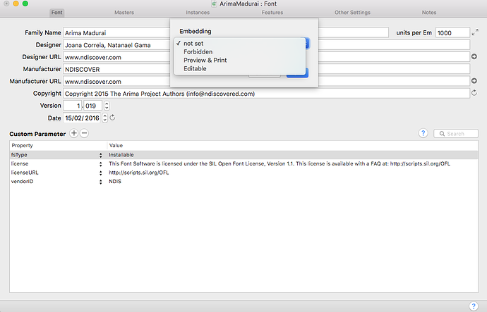

# Introduction

This page offers a checklist for running a libre font project. 

## Participating in Libre Fonts Culture

### Libre Culture

The libre software culture has influenced restricted software development practices, and is also a trending influence on type design today. 
Since fonts are software, it is helpful for all type designers to understand typical ways of running software projects. 
For type designers involved in starting or participating in libre font projects, it is especially helpful to understand how libre software project operate.
Here are a few guides to this culture:

* [opensource.guide](https://opensource.guide) (especially [/getting-paid](https://opensource.guide/getting-paid/))
* [Remix Culture](https://en.wikipedia.org/wiki/Remix_culture)
* The [Producing Open Source Software](http://producingoss.com) book
* A list of [99 anti-patterns](http://opensoul.org/2015/07/22/99ways/)
* The [Debian Social Contract](https://www.debian.org/social_contract)
* Dave Crossland's MATD Dissertation, [The Free Font Movement](https://davelab6.github.io/matd-dissertation)
* SIL's [Font Development Best Practices](http://silnrsi.github.io/FDBP/en-US/index.html) with Technical Guidance Regarding Font Development And Production

### Github Culture

At ATypI 2014 David Lemon, the senior manager of the Adobe Type group, discussed how the Adobe Type team has benefited from libre fonts culture, and that Git and Github was one of the most positive things ([reference](https://www.youtube.com/watch?v=DBz0rVUYNPA).)
Adobe have recently used the "publish early and often, gathering feedback" approach typical of libre project with the Vortice typeface project ([reference](http://blog.typekit.com/2015/03/04/introducing-vortice-and-the-adobe-type-concepts-program/).) 
A Thai type designer and web developer said this about his experience with Git:

> I used to hate Git because I don’t understand why I had to use it… until I started working with agile methods. Since then I keep using Git even on projects that I work on alone, because commit messages help me remember things I did and why I did them on each project.

Ideally all development of libre fonts is done publicly, from day one. 
This enables the public to see work in progress and point out issues during development instead of after the typical 1.0 release.

Github is a public project collaboration platform that is somewhat similar to Dropbox, but more fine-grained. 
It provides the best and most well-designed experience for public project development.

Please see the Github section further below for tips on learning Github.

### The Google Fonts Discuss mailing list

To discuss topics outside narrow per-project details, the Google Fonts type design community uses the Google Group [Google Fonts Discuss](https://groups.google.com/forum/#!forum/googlefonts-discuss)

When you begin a project, start a new thread and describe the project. 
You'll see a lot of other designers have done the same, and the responses have improved their results as there are linguists, developers and many other type designers there. 

To make your progress visible to the community, it is helpful to post a short 3 line email with 3 things:

1. What you did today
2. What you'll do the next day you work on the project
3. Any questoins for the team

If possible, add screenshots of your designs in your emails (along with links to PDFs or project files in your Github repo) as this makes the conversation on the email list much easier to follow. 

## Tools

Before you start your project, it is wise to set up all the tools that you will need in the course of development. 

### Mobile

Testing your type on mobile devices is essential, and even more important than testing on desktops.
You'll need both iOS and Android devices to do this testing.

* iPhone 4S+ with iOS 8+ ([reference](https://david-smith.org/iosversionstats/)) Safari
* Android 4.x or higher (ideally latest) with a "normal" size screen ([reference](https://developer.android.com/about/dashboards/index.html)) Chrome

Safari may have issues with OpenType feature processing, especially for complex scripts.

### Windows

No Windows-only tools are required for libre font development today.
But you will need a Windows 7 computer for testing your fonts as web fonts, especially the hinting rendering.
You can use either a physical computer, like a cheap laptop from craigslist or similar, or a virtual machine for this.

Windows 7 is the most commonly used desktop operating system ([reference](https://en.wikipedia.org/wiki/Usage_share_of_operating_systems)). 
It can also be the most challenging font rendering system compared to all other alternatives in common mass use today.

Microsoft offers zero-price virtual machine images at [modern.ie](https://dev.modern.ie/tools/vms/mac/) that can be run with [Virtual Box](https://www.virtualbox.org).

#### Web Browsers

* [Chrome 48](http://www.google.com/chrome)
* [Firefox 44](https://www.getfirefox.com)
* Microsoft Edge
* Microsoft Internet Explorer 10 (from [modern.ie](https://dev.modern.ie/tools/vms/mac/))
* [Opera 31](https://www.opera.com)
* ~~Safari~~ (No longer supported by Apple)

#### Office Applications

Many Windows users install fonts to use them in Microsoft Word or LibreOffice, so check that your fonts can be installed and set paragraphs normally in 

* Windows installation
* Microsoft Word
* Libre Office 5.1

### GNU+Linux

The [Ubuntu](https://www.ubuntu,com) distribution of GNU+Linux is the most popular, and it is important that your web fonts work with it. 
Like Windows, if your main working environment is Mac OS X, it can be run as virtual machine.

#### Web Browsers

* [Chrome 48](http://www.google.com/chrome)
* [Firefox 44](https://www.getfirefox.com)
* [Opera 31](https://www.opera.com)

#### FontForge PPA

A FontForge PPA is available. 
TODO include details

Install the python module with

    apt-get install python-fontforge;

### Mac

#### Font Installation/Management

Mac OS X has good font caching, which is good for end-users, but annoying for type designers. 
The Font Finagler tool (US$10 shareware) can take care of flushing out those font caches when you need to be sure. 

* [Font Finagler](http://www.markdouma.com/fontfinagler)

#### Web Browsers

* [Chrome 48](http://www.google.com/chrome)
* [Firefox 44](https://www.getfirefox.com)
* Safari 9
* [Opera 31](https://www.opera.com)

Safari may have issues with OpenType feature processing, especially for complex scripts.

#### Office Applications

* Microsoft Word 
* LibreOffice 5.1

#### Adobe Creative Suite

Since Google Fonts are primarily for use on the web, how web browsers render the font is primarily important. 
Today web browser applications tend to have the best and most up-to-date OpenType support anywhere, thanks to the Windows operating system and harfbuzz library efforts to be best-in-class. 
However, other applications that rely on their own OpenType processing may often exhibit font bugs that are not the fault of the font, but of the application. 
Most designers use Photoshop, Illustrator, and InDesign, so ideally your fonts will work well with these applications, but these are part of the set that do not use standard operating system OpenType processing. 

If your font works on Windows Firefox and Android Chrome, but not in Adobe applications, then it may be due to an Adobe bug. 
Be sure to check that you are using the "World Ready Composer" option which is required for many scripts to work correctly, and that your text language has been set correctly. 
If these things are confirmed, please report the issue to Adobe.

#### Libre Graphics Suite

Most designers using libre software use GIMP, Inkscape, Scribus, but currently these applications do not support OpenType.

#### Font Editors

Some useful font editor GUI applications:

* FontForge [fontforge.github.io](http://fontforge.github.io)
* Glyphs [glyphsapp.com](https://glyphsapp.com)
* FontLab [fontlab.com](https://fontlab.com)
* OTMaster [dtl.nl](http://dtl.nl)

#### Terminal Tools

Some useful font tools used in Terminal. 
When you need to type a filename for a command, you can drag and drop files from finder into Terminal and their full path will be added.

Many of these can be installed conveniently with <https://github.com/twardoch/fontsurgery-tools>

##### pip

Package manager for installing python tools. 
[pip.pypa.io](https://pip.pypa.io)

    sudo easy_install pip;

##### iPython 

Interactive python that makes writing python scripts interactive. 
Jupyter Notebook is a web UI that makes iPython even easier to use.

    sudo pip install ipython jupyter;
    jupyter notebook;

##### fonttools 

Python package for operating on binary font files. 
Install the very latest version from git master:

    sudo pip install git+git://github.com/behdad/fonttools.git;

##### pyfontaine 

Python package for analysing binary font files for script and language support. 
Install the very latest version from git master:

    sudo CFLAGS=-I/usr/local/opt/icu4c/include LDFLAGS=-L/usr/local/opt/icu4c/lib pip install pyicu;
    sudo pip install git+git://github.com/davelab6/pyfontaine.git;

##### Homebrew

Package manager for installing unix tools, such as FontForge. 
[brew.sh](http://brew.sh)

    ruby -e "$(curl -fsSL https://raw.githubusercontent.com/Homebrew/install/master/install)";
    sudo xcodebuild -license;

#### FontForge

FontForge offers a python module that can be useful.
[fontforge.org](https://fontforge.org)

    brew install python; 
    brew install fontforge --HEAD;

##### ttfautohint

Autohinter for TTF files.
[freetype.org/ttfautohint](http://freetype.org/ttfautohint/) and [manual](http://freetype.org/ttfautohint/doc/)

Install the latest version of ttfautohint from git master:

    brew install --HEAD ttfautohint --with-qt;

##### Web Font Tools

Some command line web font tools can be useful for converting to and from various web font formats.

    brew tap bramstein/webfonttools; 
    brew update; 
    brew install sfnt2woff sfnt2woff-zopfli woff2 ttf2eot sfntly;

##### vfb2ufo

Fonts developed prior to 2014 are typically in the FontLab Studio `.VFB` format. 
There are 2 tools to convert VFB files to Glyphs files. 

1. Use Glyphs's FontLab Export Macro, described in <https://glyphsapp.com/tutorials/porting-to-glyphs> and <https://glyphsapp.com/tutorials/importing-existing-fonts>

2. Use FontLab's `vfb2ufo` command line tool. This can be installed with:

    brew tap bramstein/webfonttools; 
    brew update;
    brew install vfb2ufo

##### OTS 

Web font sanitiser, used by Firefox and Chromium to reject buggy binary font files. 
**Your OTF and TTF files must pass its checks.**

Install [homebrew](#homebrew) (as above) then:

    brew tap bramstein/webfonttools; 
    brew update; 
    brew install ots --HEAD; # install

Use it like this:

    ot-sanitiser font.ttf;

When run and no output appears, it means the file is good.

##### fontbakery 

Font checking and fixing tools. 
Install the very latest version from git master:

    mkdir -p ~/src/github.com/googlefonts;
    cd ~/src/github.com/googlefonts;
    git clone git@github.com:googlefonts/fontbakery.git;
    cd fontbakery;
    sudo pip install git+git://github.com/googlefonts/fontbakery.git;

##### fontmake

New UFO and Glyphs compiler (which is still experimental, but the libre font movement is adopting so please do use and test.)
Install the very latest version from git master:

    mkdir -p ~/src/github.com/googlei18n;
    cd ~/src/github.com/googlei18n;
    git clone git@github.com:googlei18n/fontmake;
    cd fontmake;
    sudo python -m pip install -r requirements.txt;
    sudo python setup.py develop;

##### Apple OS X Font Tools

Apple provides various font utilities, and `ftxvalidator` is especially useful as it runs the same checks that are run for users when they install a font using Font Book.
You must use your Apple ID to sign in to http://developer.apple.com and download `osxfonttools.dmg` and then:

    cd ~/Downloads/ ;
    hdiutil attach osxfonttools.dmg ;
    mkdir -p /tmp/ftx ;
    cd /tmp/ftx ;
    cp "/Volumes/OS X Font Tools/OS X Font Tools.pkg" . ;
    xar -xf "OS X Font Tools.pkg" ;
    cd fontTools.pkg/ ;
    cat Payload | gunzip -dc | cpio -i ;
    sudo mv ftx* /usr/local/bin/

##### meld, icdiff

File/folder comparison application and tool, that shows two files or directories side by side, with helpful graphics to show how the files are different.

    brew install meld icdiff;

To compare two fonts using fonttools `ttx` and `meld`:

    mkdir OLD;
    mkdir NEW;
    mv Acme*.ttf OLD/;
    mv ~/Desktop/Acme*.ttf NEW/;
    ttx -s */*ttf;
    meld OLD NEW;

To use icdiff with the `git` command:

    # FIXME TODO

##### thefuck

When working on a command line, often some commands fail.
Perhaps you forgot to use a `-f` force argument, or to prepend `sudo` to run the comment as root.
<https://github.com/nvbn/thefuck> is allows you to simply run the command `fuck` and it will offer a suggestion about what to run instead, which you can accept by hitting return.
Install it with homebrew, simply run:

    brew install fuck

### Tools Further Reading 

<https://github.com/Jolg42/awesome-typography> lists many tools for working with fonts. 
If you use actively use a tool in your work, please consider contacting @davelab6 to add it to this document. 

## Project Repository

### Learning Github

There are many good guides for learning how to use Github around the web, including:

* <https://github.com/davelab6/git-for-type-designers>
* <https://try.github.io>, a 15 minute interactive game
* <http://readwrite.com/2013/09/30/understanding-github-a-journey-for-beginners-part-1>, an introduction article
* <https://guides.github.com>, well written and illustrated guides
* <http://nvie.com/posts/a-successful-git-branching-model>, an essay about using Git for ongoing project management.
* <https://www.zenhub.com/blog/best-practices-for-github-issues>, on issue management
* [Articles about Github in Wired.com](https://www.google.com/search?q=github+everything+site:wired.com)
* <https://github.com/sindresorhus/refined-github> adds power user features to the website

Github provides a proprietary-freeware desktop Git GUI, <https://desktop.github.com>. 
If you use Glyphs, the [github.com/simoncozens/GlyphsGit](https://github.com/simoncozens/GlyphsGit) plugin changes the 'save' function to integrate with Git, so that as you save like normal within the app, you are prompted for a git commit message.
These 2 tools are probably the best way to keep your work committed into git as you go. 
Doing so helps keep a journal of your progress with the project. 
If you have a habit of saving every few minutes, a good tempo for making commits is when you make a proof (either with a print layout application, or a web tester like the Impallari Testing page) 

When working with font projects on Github, it is typical to work with several "forks" of the same project, each owned by different people or organizations.
To keep things simple you should repeat the github.com site structure on your harddisk:
Create a folder in your projects directory called `github.com`, inside that make a directory for each username/organization you work with, and clone each repo inside its correpsonding folder. 

When addressing an issue, do not close it when you think it is done; 
ask for the person who reported it to verify it is resolved and then close their issue. 

When posting a Pull Request, do not merge your own PR; ask for someone to review it. 
Open PRs can be updated in-place (sometimes requiring a 'forced push' with `git push -f`) and the Github PR pages offer line-by-line commenting. 

Be sure to set git to record commits with your name, and the email you signed the Googel CLA with, otherwise your pull requests will trigger a CLA-checker warning ([example](https://github.com/google/fonts/pull/297).)
To set this metadata, run:

     git config --global user.name "Your Name" ;
     git config --global user.email user@host ;
     git config --global push.default simple;
    
You can also set git to use your preferred text editor for all git commit messages and similar. 
If you are a TextMate user, run:

     git config --global core.editor "mate -w";

Make sure to always use ssh:

    git config --global url.ssh://git@github.com/.insteadOf https://github.com/
    git config --global url.ssh://git@bitbucket.org/.insteadOf https://bitbucket.org/

#### Git on Mac

On Mac OS X, the filesystem is "case insensitive" which means these two file names access the same file data:

    monteserrat-semibold.ttf
    Montserrat-SemiBold.ttf

This often causes problems when renaming files. 
To configure git to be case-sensitive, run:

    git config core.ignorecase false

#### Github "Watch" Discussions

Github also has an email discussion feature: 
clicks 'watch' at the top of your project page, and github will email you (and all other watchers) each comment posted on the issue tracker, pull requests, or commits. 
You can reply via email to these messages, but note that your email replies **will** be posted publicly on the Github issue tracker (although attachments will be dropped.)

It is a good idea to set up an email filter to label github emails as such, to be sure you know when your reply will become public. 
See [GMail Filter and Label Documentation](https://support.google.com/mail/answer/6579?hl=en)

### Your Repository

#### Name Your Project

Aim for short, snappy, memorable name that is easy to pronounce in English. Long names can be harder for people to remember and type correctly, and problematic for software with name length limitations.

You may include stylistic or genre names in the family name. 
There are already families such as "Family Cursive" or "Family Sans" or "Family Mono," and other scripts also have visual genre names that do not refer to a particular language or set of unicode characters, like "Family Nastaliq" or "Family Kufi" or "Family Naskh" for Arabic genres.

Do not use a name already used by another published font project. [namecheck.fontdata.com](http://namecheck.fontdata.com) is a handy tool to assist such checks, along with a general web search for `name + font`

Do not include any script or language names. Eg, `Acme Arabic` or `Acme Persian`. 
(The Google Fonts API will by default serve only Basic Latin fonts; users must specify additoinal scripts. 
This means a family named with a language or script in the name will confuse users, because the font will often be served without any support for that language or script. 
More details in this [discussion](https://github.com/vaishnavimurthy/Akaya-Kannada/issues/1). 
Example multi-script families are [Baloo](https://fonts.google.com/?query=baloo) which uses a word related to the design translated in the major language used by each script, and [Hind](https://fonts.google.com/?query=hind) which use famous cities where the script is used.)

Do not use non-ASCII alphanumeric characters in the family name: 
No dashes or diacritics. 

Family names must begin with alphabet characters: 
No numbers, dashes, or diacritics.

Do not use any company names, including your own. 
Large distributors (such as Google) can not redistribute the fonts without neccessarily endorsing the named company, and companies with policies against endorsement will therefore need to rename the fonts, which is not ideal.  

Do not use any trademark names. 
Google and other redistributors may not be able to get permission to use the trademark, even if you can.

If you are making a libre version of your prior proprietary font, or designing something in an established genre, add "Libre" or a local equivalent to that well-known name Eg, `Vesper Libre` or `Libre Baskerville` or `Something Swatantra` (Hindi)

#### Trademarks 

Typically libre fonts are not subject to any trademarks.

If you do not trademark your project name:

* Do not declare trademarks in font metadata

If you do trademark your project name:

* Declare trademarks in font metadata
* License your trademarks for redistribution in a TRADEMARKS.md file ([example](https://github.com/mooniak/ayanna-font/blob/master/TRADEMARKS.md))
* Explicitly permit Google to use the trademarks. Contact Dave Crossland via email to learn how

#### Create and name your repository

Each repository should be all lowercase, with no spaces or dashes `-` for spaces.

* [Github Blog: Introducing Organizations](https://github.com/blog/674-introducing-organizations)
* [Github Help: Setting up and managing organizations and teams](https://help.github.com/categories/setting-up-and-managing-organizations-and-teams/)
* [Github Help: What's the difference between user and organization accounts?](https://help.github.com/articles/what-s-the-difference-between-user-and-organization-accounts/)
* Github Organization examples: [github.com/rosettatype](https://github.com/rosettatype) [github.com/cadsondemak](https://github.com/cadsondemak) [github.com/cyrealtype](https://github.com/cyrealtype) 

If you are a foundry or collaborative project:

* set up a [Github organization](https://help.github.com/articles/creating-a-new-organization-account/)
* create usernames for each person involved in the project, and 
* create each repo inside that organization

#### Short summary and website

At the top of the repo page is a summary input, that can be set to a short (10 words or less) description of the project. 

If the project has a gh-pages branch (see below) then use that URL, typically `https://username.github.io/project`. If you maintain a project homepage elsewhere, use that URL.

#### Turn off "wiki" and "projects"

On the setting page (eg github.com/USERNAME/REPO/settings) disable the wiki and projects features;
regular markdown files within your repo are better than a wiki, because anyone can contribute using normal pull requests.

### Repository Files

#### Keep a clean repo, with `.gitignore`

There should not be 'stray' files in the repo. 

The `.gitignore` file can prevent such files being casually commited to the repo.

Each Github repo must have a `.gitignore` file with at least the following contents

    # file manager empty files
    .DS_Store
    .empty
    .sparkleshare
    # font editor temporary files
    *(Autosaved).glyphs
    *.vfbak

#### .github Templates

TODO Add templates ideas

#### README.md

Each Github repo **MUST** have a README.md that includes at the top a descriptive summary of the design and project.

* FIXME TODO Add examples of great ones

Ideally, include an inline image near the top (see below)

#### OFL.txt

Each Github repo **MUST** have an OFL.txt containing the full text of the SIL Open Font License, and a copyright notice on the first line. 
The entire copyright notice including all names, contact information, and Reserved Font Name (RFN) notices, **all on one line.**

The copyright notice on line 1 of the OFL.txt **MUST** match the copyright notice inside each font file.

Typically this notice does **not** have an RFN at the end. 
If it does, the name declared must not be used anywhere else in the project, unless permission has been granted to Google. 
If permission has not been granted, the RFN must only appear in the copyright notices.

Since the copyright authors can change over time, such as when another author contributes to the project, write the notice for the "Acme" family as 

    Copyright 2016 The Acme Project Authors (github.com/upstream/projectname)

This necessarily means the list the authors must be maintained somewhere, so really 3 files are required:

* `OFL.txt` with the license text ([example](https://github.com/NDISCOVER/Arima-Font/blob/master/OFL.txt))
* `AUTHORS.txt` listing copyright holders ([example](https://github.com/NDISCOVER/Arima-Font/blob/master/AUTHORS.txt))
* `CONTRIBUTORS.txt` listing people who contribute but who are not actually copyright holders, eg people who work for a company that holds their copyrights as part of their employment contract ([example](https://github.com/NDISCOVER/Arima-Font/blob/master/CONTRIBUTORS.txt))

The OFL Reserved Font Name (RFN) option is not recommended for 2 reasons:

1. It makes the process of collaboration via github cumbersome; 
if a memberof the general public clicks the 'fork' button up top right, they must either seek permission from you before-hand to use the RFN, or to immediately change the font name in the files as part of their first modification, and then you'll have to change it back.

2. Many websites who self host the font files will modify them, doing subsetting and format conversion, which are both explicitly defined in the OFL as kinds of modification subject to the RFN restriction. 
SIL have been willing to offer their view that the most popular web font formats are not format conversions subject to the RFN restriction, but popular web font bundling service Font Squirrel includes the less popular formats too, which do. 
And subsetting remains. 
So, changing the name or contacting you are both administrative burdens for these downstream users, and if they do contact you, for you;
and many people won't think carefully about this and will just do so without asking, which formally terminates their license. 
Putting them in that position is not a good situation.

So not having any RFNs is best, unless you have a specific reason to use it. 

For more discussion of this topic, see 

* <https://lwn.net/Articles/552178>
* <https://github.com/simoncozens/silson/issues/1>

#### TRADEMARKS.md

If you do trademark your project name, license your trademarks for redistribution in a TRADEMARKS.md file ([example](https://github.com/mooniak/ayanna-font/blob/master/TRADEMARKS.md))

#### `documentation/`

During the course of a project many documents may be written that can be useful to store for archival purposes, such as email reviews and so on.

If you wish to include dated versions of files inside the version control system repository, the filenames should start with YYYY-MM-DD so that when the directory is listed alphabetically, the contents are sorted by date order.

Convert any offline rich document formats (DOC, RTF, etc) to MarkDown.
Some handy MarkDown editors are:

* http://macdown.uranusjr.com
* https://cloose.github.io/CuteMarkEd

#### `documentation/sample.png`

A sample.png banner image showing the project, so people get an instant and visual overview. 

Create a `documentation` subdirectory for keeping this and other such files.

#### `documentation/DESCRIPTION.en_us.html`

Description paragraphs in HTML to be used directly in the Google Fonts directory and elsewhere.

If you omit this, Google Fonts will create one based on the contents of the `README.md`

#### `documentation/BRIEF.md`

A design brief that describes the intentions and goals of the project. 
Ideally this will be be added at the start of a project, defining the milestones that will be completed.
Typically it will be based on a proposal document made by the designers for financial support to enable their project.

#### `sources/`

Project must include **actual** source files - all the files that you use yourself when developing the project, in your preferred form of modification.
These are typically files with font editor extensions (`.glyphs .ufo .vfb .sfd .sfdir`) and are often quite _messy._

Common indications of actual source files in glyph drawings are:

* guidelines
* overlapping shapes
* multiple layers with alternative drawings
* unencoded glyphs with alternative drawings
* 'smart components'

For feature files:

* descriptive comments
* commented out blocks

If your preferred form of modification is UFO, integrate [ufoNormalizer](https://github.com/unified-font-object/ufoNormalizer) into your workflow with "git hooks" so that the UFOs saved are always in the same order and disk layout.

(If you are unfamiliar with UFO, you can learn more at [unifiedfontobject.org](http://unifiedfontobject.org). 
The UFO format is itself developed on Github at [github.com/unified-font-object](https://github.com/unified-font-object/ufo-spec) and the [ufo-spec mailing list](https://groups.google.com/forum/#!forum/ufo-spec).)

If you are using Glyphs, you do not need to export a UFO along with your Glyphs file. 
Thanks to the Google Noto team, there is now a libre glyphs file parser, <https://github.com/googlei18n/glyphsLib>, so any Python capable application can use source files in the native Glyphs format. 

#### `sources/builds/` (optional)

Some type projects maintain a set of 'build sources', which are used as input to a build script. 
They are updated less frequently than the actual source files, and updated from those with care from time to time.
These are typically a set of UFOs and FDK files that are compiled with the [afdko](https://github.com/adobe-type-tools/afdko).

Common indications of build source files are:

* no or minimal guidelines
* no overlapping shapes (the result of a Remove Overlaps operation)
* a single layer per Master
* no unusual or additional unencoded glyphs with alternative drawings
* no 'smart components'

#### `sources/README.md`

Build process documentation, that explains the steps you take to build your sources into binary files.
This might also be named `BUILD-HOWTO.md` or `BUILD-INSTRUCTIONS.md`, but if it is named README.md then when you browse the `sources/` directory on Github it will be shown inline at the bottom of the page.

#### `tools/build.py` 

You may maintain a build script that runs the build steps. 

This typically accompanies the documentation above for taking those steps manually (or a mix.)

#### `fonts/otf/` and `fonts/ttf/` 

It is common to keep development versions of your fonts in the Github repo. 
However, it is hard to see the differences in binaries as they change, and makes it easy for development binaries to spread into wider use when they may not have been through the typical full testing processes used before a release.
So:

**Include font binaries only in the TTX XML format**

This is also helpful from version to version, because you can see what changed using diff tools (discussed above regarding `meld`.)

Actual OTF and TTF files should be included in a ZIP and attached to a Github Release (see below regarding Releases.)

## Pre-Production

Here are production steps you can take at the start of a project when setting up your font source files.

#### Instance and File Naming

Set up all your masters and instances at the start of the project to keep the project process iterative. Please note that The GWF backend system requires there to always be a Regular (400) style in the family.

You should plan and develop the weights of each instance early in the process.
The Impallari Type Family Steps page helps to plan the weight progression on a curve, so that the weight of middle instances are suitably light.
The master and instance interpolation values should be representative of stem weights. 
This makes it easier for people who want generate their own fonts in the future to do so. 

* http://www.impallari.com/familysteps

Filenames and naming metadata (in "Font Info" areas of font editor apps) should be made canonically, so that all font files have a predictable naming scheme suitable for both people and machine-processing. 

This [family naming scheme spreadsheet](https://docs.google.com/spreadsheets/d/1ckHigO7kRxbm9ZGVQwJ6QJG_HjV_l_IRWJ_xeWnTSBg/edit#gid=0) provides all the information in table form. 
Here is a quick reference table (but note that CSS font-weight is not the same as font metadata info.) 

| CSS font-weight | filename              | filename (italic)           |
|-----------------|-----------------------|-----------------------------|
| 100             | Roboto-Thin.ttf       | Roboto-ThinItalic.ttf       |
| 200             | Roboto-ExtraLight.ttf | Roboto-ExtraLightItalic.ttf |
| 300             | Roboto-Light.ttf      | Roboto-LightItalic.ttf      |
| 400             | Roboto-Regular.ttf    | Roboto-Italic.ttf           |
| 500             | Roboto-Medium.ttf     | Roboto-MediumItalic.ttf     |
| 600             | Roboto-SemiBold.ttf   | Roboto-SemiBoldItalic.ttf   |
| 700             | Roboto-Bold.ttf       | Roboto-BoldItalic.ttf       |
| 800             | Roboto-ExtraBold.ttf  | Roboto-ExtraBoldItalic.ttf  |
| 900             | Roboto-Black.ttf      | Roboto-BlackItalic.ttf      |

Here is the default value in FontLab 5:

Here is the corrected value:

#### fsType

The `fsType` embedding bits must be set to 0.

#### VendorID

You should set your own unique VendorID and register it with Microsoft.

* https://www.microsoft.com/typography/otspec/os2.htm#vendid

#### FFTM

If you are using FontForge, do not include the `FFTM` table.
You can do this by passing an argument to the fontforge python `font.generate()` argument.

#### DSIG table

The `DSIG` table should be included.

There is a fontbakery tool to add one, that uses fonttools:

    fontbakery-fix-dsig.py Family-Style.ttf --autofix;
    mv Family-Style.ttf.fix Family-Style.ttf;

#### gasp table 

The `gasp` should be set to 15

#### License

The license metadata should be set to the long line (which is cut off on Github, but if you triple click to select the whole line, you'll get it all - and watch out for your editor adding an unneccessary line break after the line when you paste it:

    This Font Software is licensed under the SIL Open Font License, Version 1.1. This license is available with a FAQ at: http://scripts.sil.org/OFL

#### License URL 

The license URL metadata should be set to

    http://scripts.sil.org/OFL

#### Copyright Notice

Must match line 1 of OFL.txt

#### Trademark 

Only if required, trademark metadata should be filled in ([example](https://github.com/mooniak/ayanna-font/blob/master/TRADEMARKS.md))

#### TTFAutohint Settings and Controls File

Early on in your development process, add ttf output and ttfautohint to your build process or script, and test the output on various Windows browsers. 
Be sure to use all relevant and specific command line options, which you can learn about in the ttfautohint manual.

You can improve the results of ttfautohint using a 'controls' file.
Early on in your development process, add a 'stub' controls file and improve it as the design progresses. 
There is often a sweet spot that you can reach early in the design process by scaling your design to improve the base ttfautohint results, reducing the need for controls file adjustments.

ttfautohint info should include version and parameters, by passing the `-I` option.

TTFA Info Table should not be included.

* TTFAutohint manual is at http://freetype.org/ttfautohint/doc/ttfautohint.html

#### UPM

Use a UPM of 1000 (even for TrueType fonts)

#### Vertical Metrics

From 2011 to early 2016, Raph Levien (then an engineer in the Google Fonts team) recommended that the 3 sets of vertical metrics should have been set to the y bounding box **of the family,** and both linegaps should be set to zero.
The `fontbakery-fix-vertical-metrics.py` script can help with this. 
Google Fonts also encouraged designers to determine the tallest and deepest glyphs possible in the design early in your process; these may be outside the glyph set you are intending to cover during this round of development, but should be set to allow for future development without changing the vertical metrics.

In late 2015, Raph was part an engineer in the Android team, and noted that Android TextView widgets would clip fonts beyond that, if there was no explicit padding, and since app designers tend to work only with Latin they are unlikely to set any padding ([discussion](https://groups.google.com/d/msg/googlefonts-discuss/qIPdk9Y7YUY/Eu21xtm0YrsJ).) 
Keeping all points below `1056` and above `-270`, which is 132% of a 1000 UPM font, is therefore nice to have when possible.
However, to work with many designs (such as multi-script projects) it requires scaling the drawings down to be small on the body, and since that is a problem everywhere this is not a recommendation. 

In July 2016, Khaled Hosny and Kalapi Gajjar proposed two new vertical metrics schemes which are now recommended ([discussion](https://groups.google.com/forum/#!topic/googlefonts-discuss/W4PHxnLk3JY).)

Khaled's scheme is recommended for projects that followed Raph's 2011 recommendation; in most cases it doesn't create any visible repositioning in any browsers, but testing this is required for each family that is updated.  

TODO describe Khaled's scheme

Kalapi's scheme is recommended for new projects.

TODO describe Kalapi's scheme

#### Codepages

The codepages set will determine how the font family is ordered in some software's font family lists ([discussion](https://github.com/Tarobish/Jomhuria/issues/40).)

In fonttools, Arabic fonts codepages can be set like this:

    >>> font['OS/2'].ulCodePageRange1 = 64
    >>> font['OS/2'].ulCodePageRange2 = 0

Then the family will be included with the Arabic fonts, like this:

#### Vendor ID

You may wish to set the OS/2 Vendor ID to your own 4 ASCII character value. 
Your value should be registered with Microsoft. 
If you do not yet have a value, review the Microsoft list to ensure your value is unique.

* https://www.microsoft.com/typography/links/vendorlist.aspx

#### Glyphs Specific Steps

If you are using the Glyphs editor, there are some specific steps you should take. 

* Font Info, Font, Compact File Storage, enabled.
* Font Info, Font, Disable Date Last Changed, enabled.

### Project Website

[pages.github.com](https://pages.github.com) offers a convenient way to create a blog for the project, and host live testing pages.
Some relevant links and examples:

* https://github.com/barryclark/jekyll-now is a helpful demo site
* http://tarobish.github.io/Mirza/ and http://tarobish.github.io/Katibeh/ are advanced font testing pages
* https://rosettatype.github.io and https://cadsondemak.github.io are a great examples of how to set up a Github Organization if you are practising as a foundry

## Post-Production

Here are production steps you can take during or near the end of a period of development.

#### File Names

File and naming metadata follows this ([family naming scheme spreadsheet](https://docs.google.com/spreadsheets/d/1ckHigO7kRxbm9ZGVQwJ6QJG_HjV_l_IRWJ_xeWnTSBg/edit#gid=0))

#### Vertical Metrics 

Must be set to the __family's__ y-axis bbox values, with linegaps of 0. 

This is where to find these values for each font in FontLab 5:

This is where to set the vertical metrics in FontLab 5:

#### PostScript Hinting

Production masters have PostScript manual hinting https://www.glyphsapp.com/tutorials/hinting-manual-postscript-hinting

#### TTFAutohint

Develop a ttfautohint controls file to correct any problems in hinting. 

#### Kerning

Must be included in both `GPOS` and `kern` table formats, since older versions of MS Office only use the 'kern' feature (and drop it if extension-type lookups are used.) 

FIXME TODO research this topic more to find out what essential kerning should be.

## Latin Design

#### Latin Glyph Set

There are currently 3 milestones for Latin glyphs:

* Support the 219 "base Latin" glyphs ([latin_unique-glyphs.nam](https://github.com/google/fonts/blob/master/tools/encodings/latin_unique-glyphs.nam))
* Support Abode Latin 3 (http://davelab6.github.io/abode-latin-charsets)
* Support Abode Latin 4 (mainly Vietnamese) 

FIXME TODO Come up with a definitive `latin-ext` glyph set

#### Figure Sets

Support all four figure sets. 

The general public calls old style the "jumping numbers" and like their tables to line up, especially in sans serif designs.

Lining numerals with tabular spacing must be default for all new families.

Updates to designs should also include all 4 figure styles and change the default designs to lining tabular. 

Both lining and tabular old style figures, and lining proportional figures, should be included with appropriate OpenType features. 

Tabular numbers must have a consistent glyph width across the Regular, Italic, Bold and Bold Italic styles of a family, but in other styles can be only consistent with other glyphs in the same style. 

* http://typedrawers.com/discussion/1103/tabular-figures-width-consistency 
* https://www.glyphsapp.com/tutorials/figure-sets/

#### Diacritics

Support mark based diacritics 

* https://www.glyphsapp.com/tutorials/diacritics 
* https://www.glyphsapp.com/tutorials/advanced-diacritics-multiple-anchors
* https://www.glyphsapp.com/tutorials/advanced-diacritics-narrow-marks
* http://www.urtd.net/x/cod (+ introduction at http://www.urtd.net/blog/cod)

#### Future Proof Tallest + Deepest Glyphs

Even if your planned glyph set does not include them, to future proof your design you should support from [Abode Latin 5](http://davelab6.github.io/abode-latin-charsets)

* the tallest glyph (perhaps Ǻ, per http://typedrawers.com/discussion/65/r-i-p) 
* the deepest glyph (perhaps FIXME TODO)

#### notdef

The `.notdef` glyph should be the recommended design 

* https://www.microsoft.com/typography/otspec/recom.htm

#### spaces

The spaces glyphs should follow the recommended designs

* https://www.microsoft.com/typography/developers/fdsspec/spaces.htm

#### Anchors

Anchors for all letter and diacritics 

* https://github.com/weiweihuanghuang/Work-Sans/pull/17#issuecomment-139910842

#### Prime 

The prime designs must be distinct from apostrophe 

* https://github.com/googlei18n/noto-fonts/issues/510#issue-105444463

## Kerning

All kerning and GPOS in the font is checked for mistakes

* [Mark Foley's GlyphsApp script](https://github.com/m4rc1e/mf-glyphs-scripts)) 

FIXME TODO which one exactly, and how to use it

## OpenType

You must comment all feature code that is not automatically generated.
It’s not always obvious what OpenType code in a font does, particularly with non-Latin scripts where the features that are specific to a font can be entangled with features that are required for language support. 

#### fractions, superscript and subscript numerals 

* https://www.glyphsapp.com/tutorials/fractions 
* https://www.glyphsapp.com/tutorials/superscript-and-subscript-figures 

#### Slashed Zero 

* https://www.glyphsapp.com/tutorials/slashed-zero
* https://forum.glyphsapp.com/t/tabular-slashed-zero/3987

#### Catalan 

* https://www.glyphsapp.com/tutorials/localize-your-font-catalan-punt-volat

#### Dutch 

* https://www.glyphsapp.com/tutorials/localize-your-font-accented-dutch-ij

TODO As of March 2016 this Glyphs tutorial is incomplete, we should find how what is needed to make it complete.

#### French

* http://typedrawers.com/discussion/comment/27837/#Comment_27837 Spacing can be made specific for French. 

#### German 

* https://www.glyphsapp.com/tutorials/localize-your-font-german-capital-sharp-s

#### Polish 

* https://www.glyphsapp.com/tutorials/localize-your-font-polish-kreska 
* http://www.twardoch.com/download/polishhowto/ogonek.html 

TODO The Polish kreska is not always needed, we should find out when it is and is not needed. 

#### Romanian and Moldovian 

* https://www.glyphsapp.com/tutorials/localize-your-font-romanian-and-moldovan

#### Turkish 

* https://www.glyphsapp.com/tutorials/localize-your-font-turkish http://typedrawers.com/discussion/1101/izmir-turkey

#### Case

* Lowercase octothorpe ([discussion](http://typedrawers.com/discussion/1377/lowercase-hashtag#latest))
* Period centered ([discussion](http://typedrawers.com/discussion/407/periodcentered#latest))

## Test Documents

Your project should include comprehensive testing documents, both for yourself to confirm your design works well, and so that others can evaluate their modifications.

These testing document projects may also be helpful:

* http://understandingfonts.com/2011/fonttest
* http://impallari.com/testing
* http://testmyfont.com

Test for all letter/diacritic combinations and complex script conjuncts.

* https://github.com/weiweihuanghuang/Work-Sans/pull/17#issuecomment-139910842

## Release

Abstractly, we can distinguish between work that is public and publicised. 
Proprietary software/fonts are developed privately, and then tightly couple their releases' publication and publicity, marking clear versions in each release. 

Publicly developed libre software/fonts necessarily make more of a difference between the two concepts, since publication is a constant factor.

#### Versioning

Practically speaking, the availability of fonts in the Google Fonts API is the primary point of publicity. 
A secondary point is the Github releases system, which is the best way of marking new versions available for Google Fonts to queue up to follow.

Its important that the version fields inside the source and binary font files in a release (eg in the NAME table, or Font Info inputs) match the version labelled on the release. 

[semver.org](http://semver.org) is growing in popularity as a deeply considered way of versioning software that uses 3 version numbers, `MAJOR.MINOR.PATCH`, but it does not work well for fonts because the OpenType standard only allows binary font metadata to have one period separator. 

So a `MAJOR.MINOR-or-PATCH` scheme is better for fonts, starting with `1.000` and incrementing from there (`1.001`, `1.002`, etc.) 

A MAJOR number of 0 will cause problems for some software, so `0.1` is not allowed.

It would be good to have some note in the version string where possible like 'development version' that is removed when making a release build. 
Some systems will not accept fonts with a version number of `0.something` so that can be good to use in development sources.

#### `FONTLOG.txt`
 
Create or update the FONTLOG.txt file to detail each release of the project and what changed. 

* https://github.com/fonts/skeleton/blob/skeleton/tools/FONTLOG.py can generate one.

#### `project.zip`

Use the Github Releases system to tag a release of your git repository.

* https://help.github.com/articles/about-releases/
* https://github.com/blog/1547-release-your-software
* https://help.github.com/articles/creating-releases/

and then upload a ZIP with only the actual release:

* TTF files
* OTF files
* OFL.txt
* FONTLOG.txt
* README.md

#### Release Branch

You may wish to maintain `dist` or `release` branches similar to [Git Flow]() FIXME TODO ([discussion](https://github.com/khaledhosny/libertinus/issues/13#issuecomment-176641248))

## Post Release

#### Social Media

Promote your project on social media

#### Awards

Submit your project to the many internaional type awards competitions

* TDC
* TDC2
* Granshan
* Morisawa

TODO FIXME Add more competitions

#### Fund The Next Round

As your font grows a loyal following of users, reach out to them and find out how the font can be improved, and ask them to co-pay for improvements. 

* Patreon
* Kickstarter
* SnowDrift
* Fund-IO

FIXME TODO Write more about how to do this
