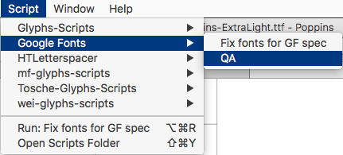
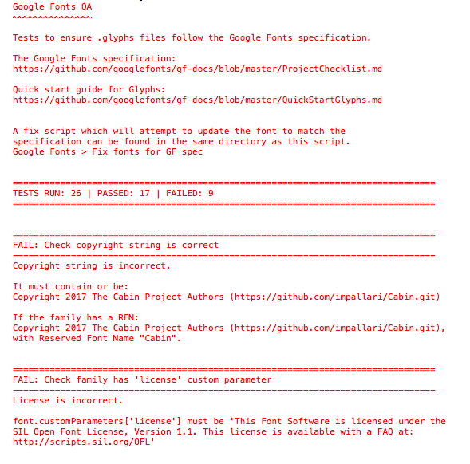
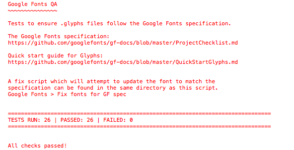
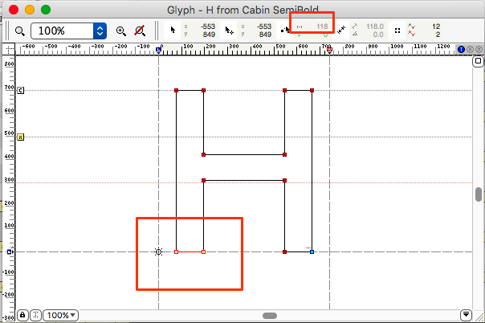
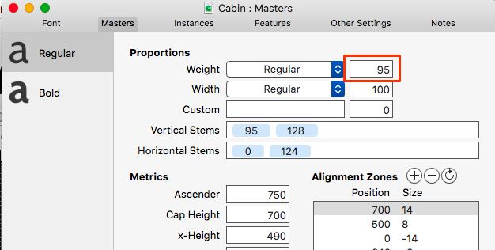
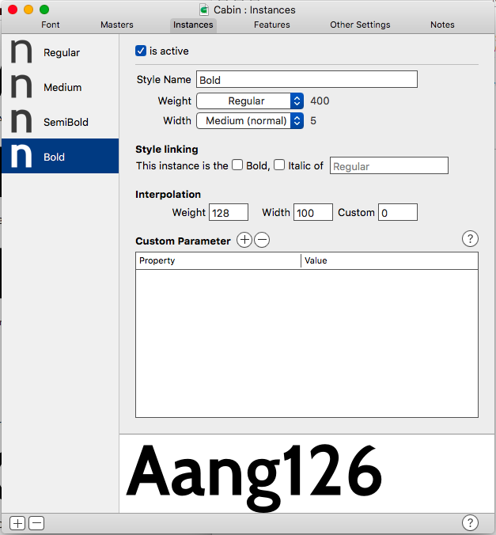
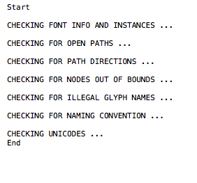

# Upgrading Existing Font Repositories

Upgrading repositories to the same standard has to be done on a case by case basis. Here are some examples of good repositories:

- [Neuton](https://github.com/m4rc1e/Neuton)
- [Mirza](https://github.com/Tarobish/Mirza)
- [Nunito](https://github.com/m4rc1e/NunitoFont)

It's worth studying these before you begin.

Older Font repositories vary greatly in quality, therefore it's very difficult to automate the upgrade process. We have written some [Glyphs scripts](https://github.com/googlefonts/gf-glyphs-scripts) to check the most important/tedious parts. The scripts are currently a work in progress, they're being updated frequently.

## Finding sources.

Locating sources is the most crucial step. Without decent sources, more effort will be required. The following approaches below are listed in priority:

1. Find repository on [Github](https://github.com)
2. Browse old [Google Fonts repositories](https://bitbucket.org/lassefister/old-googlefontdirectory/src/21142f3bf7ad39d89c1c682d30830494ef1c905c/tools/nonhinting/setnonhinting-fonttools.py?at=default&fileviewer=file-view-default)
3. Contact Author and ask for sources
4. Rebuild sources from binary ttfs

The last option should be used as a last resort only.

### Other considerations to keep in mind:

- Do the version numbers match the family which is downloadable from [Google Fonts](https://fonts.google.com)?
- Are the font binaries the same as the family which is downloadable [Google Fonts](https://fonts.google.com) (use [md5 checksum](https://www.youtube.com/watch?v=dzdom0Objq4))?
- If the family from [Google Fonts](https://fonts.google.com) and the source repository binaries are out of sync, is the repository's version number greater?
  If true, this means the repository might be a work in progress. You must decide whether it is best to work on these or rollback/find a previous version.

## High level overview of Upgrading a repository

- Reorganise repo into the following folder heirachy (example [Maven Pro](https://github.com/googlefonts/mavenproFont)):

```
├── AUTHORS.txt *
├── CONTRIBUTORS.txt *
├── OFL.txt *
├── README.md *
├── fonts *
│   ├── MavenPro-Black.ttf *
│   ├── MavenPro-Bold.ttf *
│   ├── MavenPro-Medium.ttf *
│   └── MavenPro-Regular.ttf *
├── old *
│   └── version-1.000 (use old version number) *
│       ├── DESCRIPTION.en_us.html
│       ├── METADATA.json
│       ├── MavenPro-Black.ttf
│       ├── MavenPro-Bold.ttf
│       ├── MavenPro-Medium.ttf
│       ├── MavenPro-Regular.ttf
│       ├── OFL.txt
│       └── src
│           ├── METADATA_comments.txt
│           ├── MavenPro-Black-VTT.ttf
│           ├── MavenPro-Black.glyphs
│           ├── MavenPro-Black.otf
│           ├── MavenPro-Black.vfb
│           ├── MavenPro-Bold-VTT.ttf
│           ├── MavenPro-Bold.glyphs
│           ├── MavenPro-Bold.otf
│           ├── MavenPro-Bold.vfb
│           ├── MavenPro-Medium-VTT.ttf
│           ├── MavenPro-Medium.glyphs
│           ├── MavenPro-Medium.otf
│           ├── MavenPro-Medium.vfb
│           ├── MavenPro-Regular-VTT.ttf
│           ├── MavenPro-Regular.glyphs
│           ├── MavenPro-Regular.otf
│           ├── MavenPro-Regular.vfb
│           ├── VERSIONS.txt
│           └── fontsquirrel_generator_config.txt
└── sources *
    ├── MavenPro.glyphs *
    └── build
        └── instances.yml
```

- Every file/folder with an asterisk is essential.
- Every folder should should be lowercase only.
- The **old** folder should contain the original files from the repo you are working on. They should be subfoldered with the sources version number.
- Implement everything from [ProjectChecklist.md](https://github.com/googlefonts/gf-docs/blob/master/ProjectChecklist.md)
- To test your repo matches the steps mentioned in **[ProjectChecklist.md](https://github.com/googlefonts/gf-docs/blob/master/ProjectChecklist.md)**, run the script **Google Fonts > QA**. Fix all the errors until the script passes.



- To automatically fix a lot of errors and to make sure the project conforms to the **[ProjectChecklist.md](https://github.com/googlefonts/gf-docs/blob/master/ProjectChecklist.md)**, run the script **Google Fonts > Fix fonts for GF spec**.

- Implement everything which is not design intensive from the [Cleanup Checklist](https://docs.google.com/spreadsheets/d/1vFNVR1lf14S1cthPQ59Mav5uZCnWw8_nS3ehKwueUz0/edit#gid=1988585029)
  _- MM compatiblity, anchors, kerning can take several days to implement. These should be fixed by the designer if there is enough time._
- Fix any issues reported for the family in [google/fonts/issues](https://github.com/google/fonts/issues). Again, some issues involving design or extensions will take too long to implement.
- Check and fix vertical metrics. Running **Google Fonts > Fix fonts for GF spec** will solve this automatically. For further info in vertical metrics see the [Vertical Metrics document](https://github.com/googlefonts/gf-docs/blob/master/VerticalMetrics.md)
- Round up the .glyph's file version number by +1.000. eg v2.1000 -> v3.000
- Push upgraded repo to your github account
- Send repo link to designer to work on. Link should be included in your daily work log on the [Google Fonts Group Discussion board](https://groups.google.com/forum/#!forum/googlefonts-discuss).
- Designer should send you back a pull request when they're finished. You should merge it back into your repo.
- If you originally forked the project from a Github repo. Send the author a PR of the upgraded project, with a note explaining the changes you've made as well as the designers changes. Since the upgrades are quite significant, the author usually accepts the PR. By getting the original author to merge our changes, we have consolidated all forks back into the original repo.

## Case Study: Step by step log of Upgrading Cabin

by Marc Foley

How I approach upgrading a repository so it's ready for designers to work on. The final repo can be found [here](https://github.com/m4rc1e/Cabin)

### Retrieve sources

- Luckily the project already exists on [github](https://github.com/impallari/Cabin)
- I create a fork of the project to my own [github account](https://github.com/m4rc1e/Cabin)
- I clone my fork to my local system

### Tidyup

The following section details each commit I made to my forked repo.

#### commit 1

_gitignore: Added._

_Ignore glyphsapp autosaved files_

#### commit 2

_old: Moved old v1.005 sources into old folder._

_Version number was discovered by opening ttf binary in fontlab. TTF binaries can also be opened in Glyphsapp._

#### commit 3

_txt files: Readded mandatory txt files to top level of directory._

_These will need further updating to reflect the new state of the project_

#### commit 4

_Generated .glyphs files from the extremes of MM .vfb file_

_I used this script in [Fontlab](https://github.com/schriftgestalt/Glyphs-Scripts/blob/master/Glyphs%20Export.py). '\_' in file name to denote it is a temporary file. We will delete these later, once we have them combined into 1 glyphs file'_

#### commit 5

_Cabin: Both temporary glyphs files have been combined into 1 master .glyphs file._

_Temp files also deleted_


#### commit 6

_Cabin.glyphs: Ran the script **Google Fonts > QA**._

_The script reported errors in the Glyphs files which included problems with the fsType, copyright... etc. I then ran **Google Fonts > Fix fonts for GF spec** which fixed the majority of these errors._

_We keep running the QA script each time we have made a fix to confirm it has passed. Think of it as a feedback loop._



#### commit 7

_CONTRIBUTORS.txt: added._

_Script reported this file was missing. The contributors were found by looking in the font's meta data_

#### commit 8

_Cabin.glyphs: Added vendorID._

_I had to find this by looking at a [Libre Franklin](https://github.com/impallari/Libre-Franklin) which was also made by the same author._

#### commit 9

_TRADEMARKS.md: added._

_Script reported this file was missing. Text for this file came from the trademarks field in the font metadata. I am skeptical if this is correct so I will include an issue for it on the repo._

_I have now successfully made all the checks pass for the script_



_We still need to check the MM compatibility and if we need to complete some steps from the other cleanup checklist_

#### commit 10

_Cabin.glyphs: removed Panose and glyph order family values._

_I removed the Panose because it should be unique for each weight. This field will be included in each instance later. The glyph order was removed because Glyphsapp has its own Glyph ordering function_

#### commit 11

_Cabin.glyphs: Both masters now have weight values._

_The weight values come from the vertical stem width of the 'H'. We need these values so we can generate instances. In the next step, we'll add the instances_





#### commit 12

_Cabin.glyphs: instances added._

_To get the correct weight for each instance. We need to measure the a stem of the 'H' for each style from the old fonts. The names of each instance have to match this [document](https://docs.google.com/spreadsheets/d/1ckHigO7kRxbm9ZGVQwJ6QJG_HjV_l_IRWJ_xeWnTSBg/edit#gid=0). **Google Fonts > QA** will check that each instance is named correctly._



#### commit 13

_Cabin.glyphs: ran update glyph info._

_This should rename glyphs according to Glyphsapp internal naming scheme. We can now use Glyphsapp's auto OT features etc_

#### commit 14

_Cabin.glyphs: Added auto OT features and reintroduced smcp feature._

_Glyphsapp allows us to use auto OT features. The original sources only included smcp and kern. We now have ordn, subs, sups, frac..._

#### commit 16

_Cabin.glyphs: Fixed all errors reported in Preflight font script._



_We now have a clean repo, 1 master .glyphs file with all masters and instances, correct vertical metrics, Better OT features. Luckily the original font was very good quality. Most fonts are not this easy to work on._

_I will need to repeat all the steps we did on the fonts for the Italics and Condensed files which existed in the old repo. I will also need to generate some tests fonts and run them through font bakery. I leave the font bakery step till the designers have finished working on the repo._

#### commit 17

_Cabin.glyphs: increased version number from 1.005 to 2.000_
