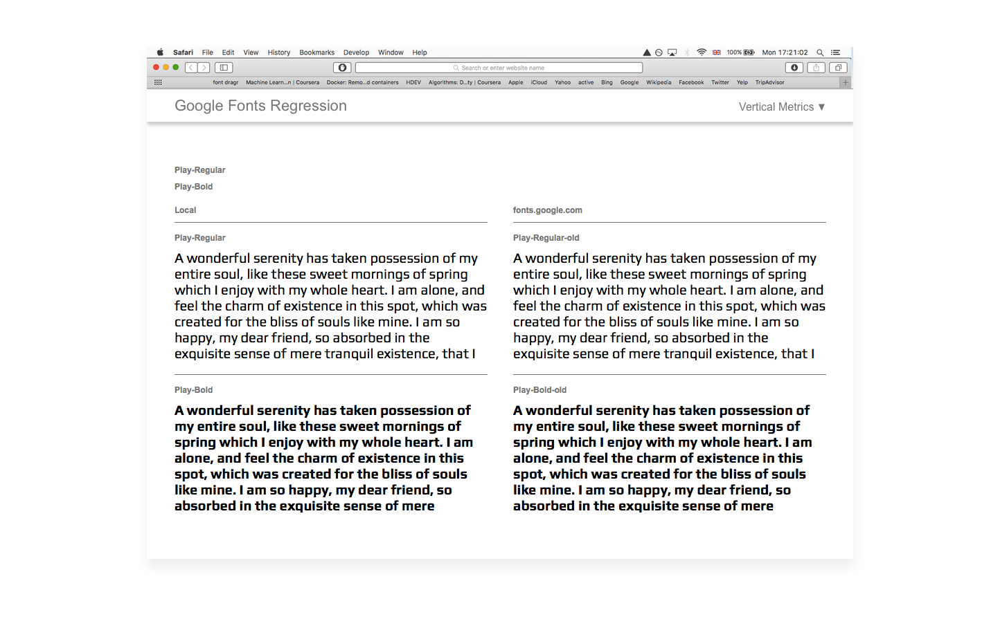

# Vertical Metrics:

Throughout countless threads and discussions, the following rules have been established.

### 1. Vertical metrics must not be calculated by the font editor automatically
We don't want this because they all do it differently. 

### 2. Vertical metrics must be consistent across a family
Every font in a family must share the same vertical metric values.

This rule can be voided if a font is being upgraded and previously had inconsistent family metrics. If this is the case, the aim should be to visually match the linespacing of each font, but fix any clipping issues caused by incorrect Win Ascent, Win Descent values.

### 3. The following vertical metric parameters must be set for each font in a family

| Ms Spec ttf spec      | Glyphsapp Master customParameter | FontLab              | ufo3 fontinfo.plist      |
| --------------------- | -------------------------------- | -------------------- | ------------------------ |
| [OS/2] sTypoAscender  | typoAscender                     | [OS/2] TypoAscender  | openTypeOS2TypoAscender  |
| [OS/2] sTypoDescender | typoDescender                    | [OS/2] TypoDescender | openTypeOS2TypoDescender |
| [OS/2] sTypoLineGap   | typoLineGap                      | [OS/2] TypoLineGap   | openTypeOS2TypoLineGap   |
|                       |                                  |                      |                          |
| [hhea] Ascender       | hheaAscender                     | [hhea] Ascender      | openTypeHheaAscender     |
| [hhea] Descender      | hheaDescender                    | [hhea] Descender     | openTypeHheaDescender    |
| [hhea] LineGap        | hheaLineGap                      | [hhea] LineGap       | openTypeHheaLineGap      |
|                       |                                  |                      |                          |
| [OS/2] usWinAscent    | winAscent                        | [OS/2] WinAscent     | openTypeOS2WinAscent     |
| [OS/2] usWinDescent   | winDescent                       | [OS/2] WinDescent    | openTypeOS2WinDescent    |

*For brevity, we'll refer to the 3 sets of metrics as Typo, Hhea, Win.* 

### 4. Win Ascent and Win Descent values must be the same as the family's tallest/deepest yMin and yMax bbox values
The Microsoft [OpenType specification](https://www.microsoft.com/typography/otspec/os2.htm#wa). Recommends the following:
>If any clipping is unacceptable, then the value should be set to yMax’.

[Overpass issue #33](https://github.com/RedHatBrand/Overpass/issues/33) demonstrates what happens in MS applications when the Win Ascent and Descent are not set correctly.

By changing these values, the line height will be increased in MS applications. This is can lead to very loose line heights if the bbox is exceedingly tall. This mainly occurs in families featuring Vietnamese, Devanagari and Arabic or other tall scripts. To counteract this, we enable [Use Typo Metrics](https://www.microsoft.com/typography/otspec/os2.htm#fss) and set the Typo values to match the previous Win values. By swapping the sets, we should retain the previous line heights in Windows as well as remove the clipping.

### 5. [Use_Typo_Metrics](https://www.microsoft.com/typography/otspec/os2.htm#fss) must be enabled
This will force MS Applications to use the OS/2 Typo values instead of the Win values. By doing this, we can freely set the Win values to avoid clipping and control the line height with the typo values. It has the added benefit of future line height compatibility. When a new script is added, we simply change the Win values to the new yMin and yMax, without needing to worry if the line height have changed.

### 6. If the family is being updated, the line height must visually match the previous release.
Some applications do not allow users to control the line height/leading of their fonts. Word processors and text editors are common culprits. It is essential their documents do not reflow.

### 7. Hhea and Typo metrics should match
Hhea metrics are used in Mac OS X, whilst Microsoft uses Typo when Use_Typo_Metrics is enabled. They should ideally be identical.

This rule can be voided if a font is being upgraded and previously had inconsistent values.

---

## Examples:

Setting vertical metrics usually falls into the following two categories:

1. Calculating the vertical metrics for a new family
2. Recalculating the vertical metrics for an upgraded family

### 1. Calculating the vertical metrics for a new family

Kalapi Gajjar-Bordawekar outlined a [vertical metric schema](https://groups.google.com/d/msg/googlefonts-discuss/W4PHxnLk3JY/KoMyM2CfAwAJ). The GF team adopted this for new releases only:

- Typo Ascender = either Cap Height or Ascender height, whichever is tallest
- Typo Descender = Typo Ascender - UPM
- Typo LineGap = 0.25 * UPM
- Hhea Ascender = Typo Ascender
- Hhea Descender = Typo Descender
- Hhea LineGap = Typo LineGap
- Win Ascent = Font bbox yMax
- Win Descent = Font bbox yMin

Our new family has the following specification:
- upm is 1000
- yMax is 1050
- yMin is -250
- Cap height of 'H' is 700
- Descender is -245

1. Set the default values, following Kalapi's schema:

    - Typo Ascender = 700. Set to our Cap height
    - Typo Descender = -300. Typo Ascender - upm
    - Typo LineGap = 250. 0.25 * upm
    - Hhea Ascender = 700. Typo Ascender
    - Hhea Descender = -300. Typo Descender
    - Hhea LineGap = 250. Typo LineGap
    - Win Ascent = 1050. Font bbox yMax
    - Win Descent = 250. Font bbox yMin (positive integer)

2. Adjust the Typo/Hhea values visually.

    Often, the default values are sufficient, sometimes it helps to tweak them a little.

    Use either Notepad or Text Edit to establish the perfect visual balance. Both the hhea and typo values should always match each other.

3. Copy metric values to rest of the styles/weights in the family
4. Enable Use_Typo_Metrics

### 2. Recalculating the vertical metrics for an upgraded family

Many font families receive upgrades, either by the original author or a 3rd party. When character extensions occur which modify the font's bounding box, the vertical metrics will need to be recalculated. 

Imagine we have a previous v1.000 release. We're now adding Vietnamese. The version number has been bumped to V2.000. The font's bbox yMax has changed from 1000 to 1100 and yMin from -200 to -300.

v1.000 had the following family vertical metrics:

- Typo Ascender = 800
- Typo Descender = -200
- Typo LineGap = 200
- Hhea Ascender = 800
- Hhea Descender = -200
- Hhea LineGap = 200
- Win Ascent = 1000
- Win Descent = 200

*Notice each set set adds up to 1200, if the negative integers are converted to positive. This should lead to consistent metrics across each platform*

There are two cases which can occur.

#### I. Use_Typo_Metrics was already enabled in the v1.000 release.
The Win Ascent and Win Descent simply need to reflect the new yMin and yMax values.

1. v2.000 vertical metrics:

    - Typo Ascender = 800
    - Typo Descender = -200
    - Typo LineGap = 200
    - Hhea Ascender = 800
    - Hhea Descender = -200
    - Hhea LineGap = 200
    - **Win Ascent = 1100. Font bbox yMax**
    - **Win Descent = 300. Font bbox yMin (positive integer)**

#### II. Use_Typo_Metrics was not enabled in the previous release.
The Typo Metrics need to inherit the v1.000 Win values. The Win Ascent and Win Descent also need to reflect the new yMin and yMax values.

1. v2.000 vertical metrics:

    - **Typo Ascender = 1000. Old Win Ascent**
    - **Typo Descender = -200. Old negative Win Ascent**
    - **Typo LineGap = 0. Win Metrics has no LineGap parameter so we set this to 0**
    - Hhea Ascender = 800
    - Hhea Descender = -200
    - Hhea LineGap = 200
    - **Win Ascent = 1100. Font bbox yMax**
    - **Win Descent = 300. Font bbox yMin (positive integer)**

2. Repeat process for each weight/style if values are not unique in v1.000
3. Enable Use_Typo_Metrics

If the font was previously hosted on fonts.google.com, you can test the upgraded vertical metrics visually match by using [GF Regression](http://45.55.138.144).

*Play's vertical metrics being tested, left: Local version, right: fonts.google.com version*

Useful Links:
- [Kalapi vertical metrics schema](https://groups.google.com/d/msg/googlefonts-discuss/W4PHxnLk3JY/KoMyM2CfAwAJ)
- [Khaled vertical metrics schema](https://groups.google.com/d/msg/googlefonts-discuss/W4PHxnLk3JY/MYgVlQMjAwAJ)
- [Vertical metrics recommendations](VerticalMetricsRecommendations.md)

## Useful Tools:
### Glyphsapp Scripts
- [gf-glyphs-scripts](https://github.com/googlefonts/gf-glyphs-scripts) 'QA' script includes several vertical metrics checks. 'Fix fonts for GF spec' will automatically update a family's vertical metrics so they visually match a previous release (if it exists). It will also set the values so no clipping will occur on Windows platforms.

### Testing:
- [Impallari/testing](http://www.impallari.com/testing/): Font tester which has no css line-height property set
- [GF Regression](http://45.55.138.144): Check local fonts against currently hosted versions on fonts.google.com