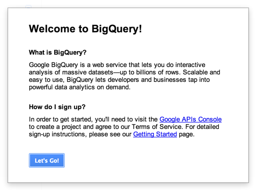
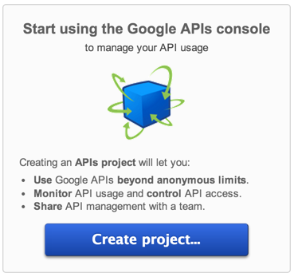
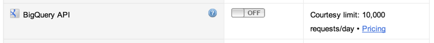
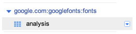
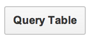

# Large-scale Web Font Analysis

**This database is no longer available, the following is for historical interest only.**

The Large-scale Web Font Analysis data set is a tool to understand the adoption of web fonts across the web. 
This document explains

* how to access and query the data, 
* the provenance of the data and how it was processed, 
* its schema, 
* and provides some query examples of interesting data that can be obtained from the data set, for example, _"What are the top fonts across the Alexa Top 1M?"_


## Getting Started

The URL of the data set is https://bigquery.cloud.google.com/table/google.com:googlefonts:fonts.analysis

The data set is hosted on BigQuery, a web web-based query tool that allows for interactive exploration of massive data sets. 

More information about the syntax of querying BigTable can be found at the [BigQuery Query Reference](https://cloud.google.com/bigquery/query-reference) page.


### How To Query The Data

1. Access the table in BigQuery: http://bigquery.cloud.google.com/dataset/google.com:googlefonts:fonts

2. If needed, sign in using a BigQuery account

3. At the dialog, click `Let's Go!` — you'll be redirected to the Google API console, to accept the terms of service. <br>

4. At the Google API console, create a new project and name it something that you will remember, by clicking `Create project...` <br>

5. Enable the BigQuery API by toggling its button in the list of available APIs <br> 

6. At this point, you will be asked to review and accept the terms of service for the data. _Note that there is a daily limit to API access._

7. Return to the BigQuery page, http://bigquery.cloud.google.com/dataset/google.com:googlefonts:fonts

8. Find the fonts project on the left side of the page, and click the "analysis" project <br> 

9. Click "Query table" on the top-right <br> 

10. Compose a query and click `Run query` to get the result


## Understanding The Metadata

This section explains the origin and processing of the data in the Large-Scale Web Font Adoption Analysis.

In a nutshell, the goal of the project was to measure the adoption of the web fonts across the Alexa Top 1M sites (domains). 
Initially the analysis was just over the top-level (or home) page of each domain, however we were able to take it further and perform a deep analysis over each of the domains.

To accelerate the adoption of web fonts even further, we are excited to share the data via Google BigQuery, such that everyone can drill deeper into the data. 
In exploring the data together, we could all uncover interesting trends, findings and facts: where web fonts have been adopted, where they haven’t and such.


### Web Pages

The analysis measures adoption of web fonts across the Alexa Top 1M, a third-party list of popular domains that has been used by other analyses of the adoption of web technologies, such as that of [HTTP Archive](http://httparchive.org). 
The list of sites is available as a free download from [Alexa Top Sites](http://www.alexa.com/topsites), see the “Top 1,000,000 Sites” link in the upper right corner.

All of the web sites in the crawl are public and readily accessible to anyone. 
Any restrictions on crawling, such as those specified in a robots.txt file, are respected.


### Processing

Accurately determining whether a web page uses web fonts can be quite challenging. 
Thus, consider this first analysis a work in progress.

To best determine if a web page uses web fonts, each web page was loaded with a headless version of Chrome and then the resulting render tree + requested resources were inspected. 
As a result, we were able to determine not only which fonts were used, but what percent of text was rendered with each font on the page. 
Due to the various ways in which web fonts can be integrated into a web page (see [Integration Patterns](#Integration-Patterns) below), determining which font came from which service (or was self-hosted) is subject to more inaccuracy. 
Where we were unable to determine the source, we considered the integration to be self-hosted. 
As a result, the reported self-hosted numbers could be over-inflated, while the ones for some services could be under counted. 
As the Google Font API stylesheet/font links were easily parseable, the accuracy is much higher for Google Fonts.

After performing the full analysis, the data was pushed to BigQuery in the schema defined below.


### Schema

The analysis schema contains high-level web font usage information for the Alexa Top 1M domains, and then for each domain a few representative (example) pages illustrating the various web font service integrations for the domain.

| FIELD NAME               | TYPE    | SUBTYPE    | DESCRIPTION |
|:-------------------------|:-------:|:----------:|:------------|
| rank                     | INTEGER | _OPTIONAL_ | The Alexa rank of the domain (e.g. 1 for google.com)  |
| domain                   | STRING  | _REQUIRED_ | The domain name that was analyzed (e.g. www.google.com) |
| pages                    | INTEGER | _REQUIRED_ | An order of magnitude (e.g. 1K, 10K, … 1M) representing the number of pages analyzed for this domain |
| with\_fonts              | INTEGER | _REQUIRED_ | An order of magnitude (e.g. 1K, 10K, … 1M) representing the number of pages using web fonts for this domain |
| with\_fonts\_pct         | INTEGER | _REQUIRED_ | Percent of pages using web fonts for this domain |
| with\_google\_fonts      | INTEGER | _REQUIRED_ | An order of magnitude (e.g. 1K, 10K, … 1M) representing the number of pages using Google Fonts for this domain |
| with\_google\_fonts\_pct | INTEGER | _REQUIRED_ | Percent of pages using Google Fonts for this domain |
| services                 | STRING  | _REPEATED_ | A list of font services used within this domain, such as: GOOGLE, SELF_HOST, TYPEKIT, MONOTYPE, HFJ, etc. |
| google\_fonts            | STRING  | _REPEATED_ | A list of the Google Fonts (e.g hosted by google.com, such as Open Sans, Oswald, Droid Sans, Droid Serif, etc) that were used within this domain |
| page                     | RECORD  | _REPEATED_ | A list of example pages that were analyzed for this domain (up to one example per service) |
| page.url                 | STRING  | _REQUIRED_ | The URL of the example page (e.g. www.google.com/about) |
| page.rank                | INTEGER | _OPTIONAL_ | Alexa rank of the parent domain (e.g. 1 for google.com) |
| page.services            | STRING  | _REPEATED_ | A list of font services used within this example page |
| page.google\_fonts       | STRING  | _REPEATED_ | A list of the Google Fonts used on this page |
| page.language            | STRING  | _NULLABLE_ | This is the primary language of the domain based on the content-language meta tag / header of the page. _Note, in practice this is seldom set_ |
| page.country             | STRING  | _NULLABLE_ | This is the country of the domain based on the content-language meta tag / header of the page. _Note, in practice this is seldom set_ |
| page.font                | RECORD  | _REPEATED_ | This is a repeated record of individual fonts used on a page |
| page.font.name           | STRING  | _REQUIRED_ | This is a font family used in a domain |
| page.font.percent        | INTEGER | _REQUIRED_ | This is the percent of a domain's text that is in that font family |


### Integration Patterns

These are the web font service integration patterns that were used to determine (in checking the referenced resources loaded by Chrome) if a given page used web fonts and then from which service.

| PROVIDER                       | PATTERN |
|:-------------------------------|:--------|
| Google Fonts                   | fonts.googleapis.com/css themes.googleusercontent.com/fonts ssl.gstatic.com/fonts |
| Fonts.com Web Fonts (Monotype) | fast.fonts.com/cssapi |
| Adobe Typekit                  | use.typekit.(comnet) |
| Adobe Edge Web Fonts           | use.edgefonts.com |
| Hoefler Type Co                | cloud.typography.com/[0-9/]*/css/fonts.css |
| Fontdeck                       | f.fontdeck.com/s/css |
| webtype (Font Bureau)          | cloud.webtype.com/css |
| WebINK                         | fnt.webink.com |
| FontsLive                      | webfonts.fontslive.com |
| Kernest                        | kernest.com/fonts |
| Typesquare                     | typesquare.com/accessor/script/typesquare.js |
| Mobilis                        | api.mobilis.co.kr/webfonts/css?fontface= |
| Decomoji                       | site.decomoji.jp/js |
| Typotheque                     | wf.typotheque.com |
| Typefront                      | typefront.com/fonts |
| justfont.com                   | ds.justfont.com/core/js/ |


## Example Queries


**Number of DOMAINS analyzed in the Alexa Top 1M** (Eg, ~900K)
```sql
google.com:googlefonts> SELECT COUNT(DISTINCT(domain)) AS Domains FROM [google.com:googlefonts:fonts.analysis];
+---------+
| Domains |
+---------+
|  906684 |
+---------+
```

**Number of PAGES analyzed** (Eg, 2B)
```sql
google.com:googlefonts> SELECT sum(pages) AS Pages FROM [google.com:googlefonts:fonts.analysis];
+------------+
|   Pages    |
+------------+
| 2035606840 |
+------------+
```

**Number of PAGES in the Alexa Top 1K, 10K, 100K** (Eg, 165M, 605M, 1.3B)
```sql
google.com:googlefonts> SELECT sum(pages) AS Pages FROM [google.com:googlefonts:fonts.analysis] WHERE rank <= 1000;
+-----------+
|   Pages   |
+-----------+
| 165412338 |
+-----------+

google.com:googlefonts> SELECT sum(pages) AS Pages FROM [google.com:googlefonts:fonts.analysis] WHERE rank <= 10000;
+-----------+
|   Pages   |
+-----------+
| 605632790 |
+-----------+

google.com:googlefonts> SELECT sum(pages) AS Pages FROM [google.com:googlefonts:fonts.analysis] WHERE rank <= 100000;
+------------+
|   Pages    |
+------------+
| 1300949425 |
+------------+
```

**Number AND Percent of PAGES in the Alexa Top 100, 1K, 10K, 100K, 1M using web fonts**
```sql
google.com:googlefonts> SELECT sum(pages) AS Pages, sum(with_fonts) AS WithFonts, round(100*sum(with_fonts)/sum(pages)) AS Percent FROM [google.com:googlefonts:fonts.analysis] WHERE rank <= 1000;
+-----------+-----------+---------+
|   Pages   | WithFonts | Percent |
+-----------+-----------+---------+
| 165412338 |  37020264 |    22.0 |
+-----------+-----------+---------+

google.com:googlefonts> SELECT sum(pages) AS Pages, sum(with_fonts) AS WithFonts, round(100*sum(with_fonts)/sum(pages)) AS Percent FROM [google.com:googlefonts:fonts.analysis] WHERE rank <= 10000;
+-----------+-----------+---------+
|   Pages   | WithFonts | Percent |
+-----------+-----------+---------+
| 605632790 | 125466311 |    21.0 |
+-----------+-----------+---------+

google.com:googlefonts> SELECT sum(pages) AS Pages, sum(with_fonts) AS WithFonts, round(100*sum(with_fonts)/sum(pages)) AS Percent FROM [google.com:googlefonts:fonts.analysis] WHERE rank <= 100000;
+------------+-----------+---------+
|   Pages    | WithFonts | Percent |
+------------+-----------+---------+
| 1300949425 | 269151301 |    21.0 |
+------------+-----------+---------+

google.com:googlefonts> SELECT Total, Pages, round(100*Pages/Total) AS Percent FROM (SELECT sum(pages) AS Total, sum(with_fonts) Pages FROM [google.com:googlefonts:fonts.analysis]);
+------------+-----------+---------+
|   Total    |   Pages   | Percent |
+------------+-----------+---------+
| 2035606840 | 407505337 |    20.0 |
+------------+-----------+---------+
```

**Top fonts (incl. system fonts) across the Alexa Top 1M**
```sql
google.com:googlefonts> SELECT COUNT(*) AS Count, top(page.font.name, 10) AS Font FROM [google.com:googlefonts:fonts.analysis];
+--------+----------------+
| Count  |      Font      |
+--------+----------------+
| 463529 | arial          |
| 227085 | verdana        |
| 194627 | sans-serif     |
| 135669 | tahoma         |
|  95332 | georgia        |
|  74142 | helvetica neue |
|  69530 | helvetica      |
|  66348 | trebuchet ms   |
|  44130 | open sans      |
|  37722 | lucida grande  |
+--------+----------------+
```

**Web Font usage by Tier (domains, grouped by number of pages)**
```sql
google.com:googlefonts> SELECT COUNT(*) AS Count, top(with_fonts) AS Tier FROM [google.com:googlefonts:fonts.analysis];
+--------+---------+
| Count  |  Tier   |
+--------+---------+
| 603697 |       1 |
| 103494 |      10 |
| 103187 |     100 |   103K web sites (domains) using web fonts on 100+ web pages
|  45698 |    1000 |
|   9585 |   10000 |
|   1260 |  100000 |
|    128 | 1000000 |   128 web sites (domains) using web fonts on 100K+ web pages
+--------+---------+
```

**Pages using ‘Comic Sans’ for most of the text on the page**
```sql
google.com:googlefonts> SELECT page.rank AS Rank, page.font.name AS Font, page.font.pct AS Percent, LEFT(page.url, 60) AS URL FROM [google.com:googlefonts:fonts.analysis] WHERE page.font.name contains "comic sans" AND page.font.pct = 100 ORDER BY Rank asc LIMIT 10;
+-------+---------------+---------+--------------------------------------------------------------+
| Rank  |     Font      | Percent |                             URL                              |
+-------+---------------+---------+--------------------------------------------------------------+
|  4231 | comic sans ms |     100 | http://www.teensnow.com/c/1176/teen-13                       |
| 12111 | comic sans ms |     100 | http://military38.com/tag/%E5%98%98                          |
| 13734 | comic sans ms |     100 | http://www.x-ho.com/amateur/casero/en/video/by_date.html?pag |
| 16354 | comic sans ms |     100 | http://www.pickyourown.org/FAQs_tomatoes.htm                 |
| 25771 | comic sans ms |     100 | http://www.collegerules.com/t11/trailer/looks-like-an-exciti |
| 27820 | comic sans ms |     100 | http://www.momshere.com/st/archives/archive7.shtml           |
| 34284 | comic sans ms |     100 | http://dimasport.net/component/videoflow/?task=play&id=55&It |
| 34972 | comic sans ms |     100 | http://www.madmamas.com/                                     |
| 36046 | comic sans ms |     100 | http://petiteteenager.com/models/planet-eva/                 |
| 39230 | comic sans ms |     100 | http://www.submissionworks.com/privacy.html                  |
+-------+---------------+---------+--------------------------------------------------------------+
```

**Top Sites using ‘Source Sans Pro’ for 100% of the text on the page**
```sql
google.com:googlefonts> SELECT page.rank AS Rank, page.font.name AS Font, page.font.pct AS Percent, LEFT(page.url, 60) AS URL FROM [google.com:googlefonts:fonts.analysis] WHERE page.font.name contains "source sans pro" AND page.font.pct = 100 ORDER BY Rank asc LIMIT 10;
+------+-----------------+---------+--------------------------------------------------------------+
| Rank |      Font       | Percent |                             URL                              |
+------+-----------------+---------+--------------------------------------------------------------+
|  349 | source sans pro |     100 | http://www.joomla.org/3/                                     |
|  641 | source sans pro |     100 | http://www.cbslocal.com/                                     |
| 1373 | source sans pro |     100 | http://www.noyapps.com/lp/codecperformer/v14/cache/index-en. |
| 1407 | source sans pro |     100 | http://www.walmart.com.br/                                   |
| 2882 | source sans pro |     100 | http://www.qualtrics.com/                                    |
| 3517 | source sans pro |     100 | http://www.tripwiremagazine.com/demos/lettering-demo/index2. |
| 3771 | source sans pro |     100 | http://www.optimizepress.com/                                |
| 3923 | source sans pro |     100 | http://cloudzer.net/                                         |
| 4167 | source sans pro |     100 | http://www.azcentral.com/live/m/                             |
| 5795 | source sans pro |     100 | http://www.aftermarket.pl/                                   |
+------+-----------------+---------+--------------------------------------------------------------+
```

**Top Google Fonts**
```sql
google.com:googlefonts> SELECT COUNT(*) AS Count, top(google_fonts, 10) AS Font FROM [google.com:googlefonts:fonts.analysis] WHERE google_fonts is not null;
+-------+---------------------+
| Count |        Font         |
+-------+---------------------+
| 64300 | Open Sans           |
| 53696 | Roboto              |
| 29915 | Oswald              |
| 25156 | Droid Sans          |
| 14113 | Lato                |
| 13860 | PT Sans             |
| 13264 | Droid Serif         |
| 11788 | Open Sans Condensed |
| 10555 | Raleway             |
|  9448 | Ubuntu              |
+-------+---------------------+
```

**Domains in the Alexa Top 1K with the highest percent of web font use AND fonts they use**
```sql
google.com:googlefonts> SELECT rank AS Rank, domain AS Domain, with_fonts AS Pages, with_fonts_pct AS Percent, page.font.name AS Font FROM [google.com:googlefonts:fonts.analysis] WHERE rank BETWEEN 0 AND 10000 ORDER BY Percent desc, Rank asc LIMIT 10;
+------+---------------+---------+---------+---------------------+
| Rank |    Domain     |  Pages  | Percent |        Font         |
+------+---------------+---------+---------+---------------------+
|   15 | wordpress.com |    1000 |     100 | open sans           |
|   15 | wordpress.com |    1000 |     100 | merriweather        |
|   37 | instagram.com | 1000000 |     100 | freight-sans-pro    |
|   37 | instagram.com | 1000000 |     100 | proxima-nova        |
|   66 | wordpress.org |  100000 |     100 | -webkit-sans-serif  |
|   66 | wordpress.org |  100000 |     100 | helvetica           |
|   66 | wordpress.org |  100000 |     100 | helveticaneue-light |
|   66 | wordpress.org |  100000 |     100 | mensch-wf           |
|   66 | wordpress.org |  100000 |     100 | open sans           |
|   66 | wordpress.org |  100000 |     100 | -webkit-sans-serif  |
+------+---------------+---------+---------+---------------------+
```

**Domains with 100K+ pages that use web fonts, the number of pages they use them on AND the services they use**

```sql
google.com:googlefonts> SELECT rank AS Rank, domain AS Domain, with_fonts AS Pages, with_fonts_pct AS Percent, services AS Services FROM [google.com:googlefonts:fonts.analysis] WHERE pages = 1000000 AND rank BETWEEN 0 AND 10000 ORDER BY Pages desc, Rank asc LIMIT 10;
+------+---------------------+---------+---------+-----------+
| Rank |       Domain        |  Pages  | Percent | Services  |
+------+---------------------+---------+---------+-----------+
|   12 | www.blogger.com     | 1000000 |      94 | SELF_HOST |
|   12 | www.blogger.com     | 1000000 |      94 | GOOGLE    |
|   37 | instagram.com       | 1000000 |     100 | SELF_HOST |
|   94 | www.dailymotion.com | 1000000 |      57 | SELF_HOST |
|   94 | www.dailymotion.com | 1000000 |      57 | GOOGLE    |
|  111 | www.aliexpress.com  | 1000000 |      73 | SELF_HOST |
|  164 | badoo.com           | 1000000 |      53 | SELF_HOST |
|  200 | www.softonic.com    | 1000000 |     100 | SELF_HOST |
|  201 | photobucket.com     | 1000000 |     100 | SELF_HOST |
|  210 | github.com          | 1000000 |      99 | GOOGLE    |
+------+---------------------+---------+---------+-----------+
```

**Web Font services used by google.com AND an example of each**

```sql
google.com:googlefonts> SELECT rank AS Rank, domain AS Domain, with_fonts AS Pages, services AS Services FROM [google.com:googlefonts:fonts.analysis] WHERE domain = "www.google.com";
+------+----------------+--------+-----------+
| Rank |     Domain     | Pages  | Services  |
+------+----------------+--------+-----------+
|    1 | www.google.com | 100000 | GOOGLE    |
|    1 | www.google.com | 100000 | HFJ       |
|    1 | www.google.com | 100000 | SELF_HOST |
|    1 | www.google.com | 100000 | TYPEKIT   |
+------+----------------+--------+-----------+

google.com:googlefonts> SELECT domain AS Domain, LEFT(page.url, 60) AS URL, page.font.name AS Font, page.font.pct AS Percent FROM [google.com:googlefonts:fonts.analysis] WHERE domain = "www.google.com" ORDER BY URL, Percent desc;
+----------------+--------------------------------------------------------------+--------------------------+---------+
|     Domain     |                             URL                              |           Font           | Percent |
+----------------+--------------------------------------------------------------+--------------------------+---------+
| www.google.com | http://www.google.com/loon/                                  | karla                    |      85 |
| www.google.com | http://www.google.com/loon/                                  | steelfishltregular       |      15 |
| www.google.com | http://www.google.com/tv/                                    | arial                    |      85 |
| www.google.com | http://www.google.com/tv/                                    | open sans                |      15 |
| www.google.com | https://www.google.com/producer/editions/CAow4Go/cnet/CAIiEP | helvetica                |      74 |
| www.google.com | https://www.google.com/producer/editions/CAow4Go/cnet/CAIiEP | franklin-gothic-urw-cond |      25 |
| www.google.com | https://www.google.com/producer/editions/CAow4Go/cnet/CAIiEP | helvetica neue           |       1 |
| www.google.com | https://www.google.com/producer/editions/CAow4Hc/the_99/CAIi | georgia                  |      88 |
| www.google.com | https://www.google.com/producer/editions/CAow4Hc/the_99/CAIi | helvetica neue           |       6 |
| www.google.com | https://www.google.com/producer/editions/CAow4Hc/the_99/CAIi | tungsten a               |       6 |
+----------------+--------------------------------------------------------------+--------------------------+---------+

google.com:googlefonts> SELECT domain AS Domain, LEFT(page.url, 60) AS URL, page.services AS Services FROM [google.com:googlefonts:fonts.analysis] WHERE domain = "www.google.com" ORDER BY URL;
+----------------+--------------------------------------------------------------+-----------+
|     Domain     |                             URL                              | Services  |
+----------------+--------------------------------------------------------------+-----------+
| www.google.com | http://www.google.com/loon/                                  | SELF_HOST |
| www.google.com | http://www.google.com/loon/                                  | GOOGLE    |
| www.google.com | http://www.google.com/tv/                                    | GOOGLE    |
| www.google.com | https://www.google.com/producer/editions/CAow4Go/cnet/CAIiEP | TYPEKIT   |
| www.google.com | https://www.google.com/producer/editions/CAow4Hc/the_99/CAIi | SELF_HOST |
| www.google.com | https://www.google.com/producer/editions/CAow4Hc/the_99/CAIi | HFJ       |
+----------------+--------------------------------------------------------------+-----------+
```

**Top Google Fonts Integrations**
```sql
google.com:googlefonts> SELECT Rank, Domain, with_fonts AS Pages FROM [google.com:googlefonts:fonts.analysis] WHERE services contains "GOOGLE" ORDER BY Pages desc, Rank asc LIMIT 5;
+------+----------------------+---------+
| Rank |        Domain        |  Pages  |
+------+----------------------+---------+
|   12 | www.blogger.com      | 1000000 |
|   94 | www.dailymotion.com  | 1000000 |
|  210 | github.com           | 1000000 |
|  242 | www.zillow.com       | 1000000 |
|  246 | www.shutterstock.com | 1000000 |
+------+----------------------+---------+
```

**Top Sites using Source Sans Pro**
```sql
SELECT
  page.rank AS Rank,
  page.domain as Domain,
  page.font.name AS Font,
  page.font.pct AS Percent,
  LEFT(page.url,
    60) AS URL
FROM
  [google.com:googlefonts:fonts.analysis]
WHERE
  page.font.name CONTAINS "source sans pro"
  AND page.font.pct > 25
ORDER BY
  Rank ASC
LIMIT
  100;
```
