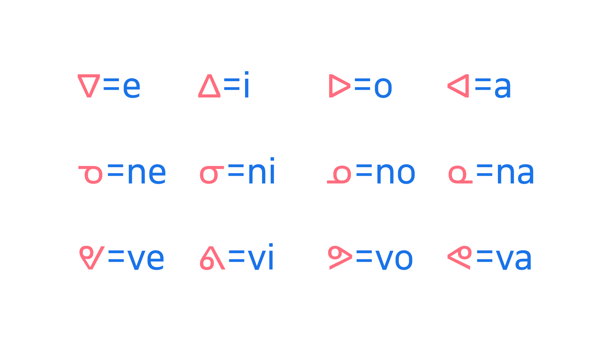

An abugida (often also referred to as an alphasyllabary) is a writing system that combines consonants and vowels into a singular unit, with the consonant being the primary element, and the vowel secondary. 

<figure>

</figure>
<figcaption>A diagram depicting syllabics characters, which represent syllables within the Canadian Aboriginal Syllabics writing system scheme. A consonant is represented by a base form, with the vowel in a syllable being inflected depending on the orientation of the base symbol. In the above example, the first line shows the pure vowel series, with subsequent syllable series’ on lines two and three, made up of syllabic base characters across their four rotations.</figcaption>

This is unlike an alphabet, where consonants and vowels are treated equally, and unlike a syllabary, where it’s impossible to split the symbols into individual elements. Examples of abugidas include the Brahmic scripts of India and the Canadian Aboriginal syllabics. 

It’s technically possible to have an abugida that is not an alphasyllabary, and an alphasyllabary that is not an abugida. To explore the subtle and often debated nuances, please see [the “Abugida” article on Wikipedia](https://en.wikipedia.org/wiki/Abugida).