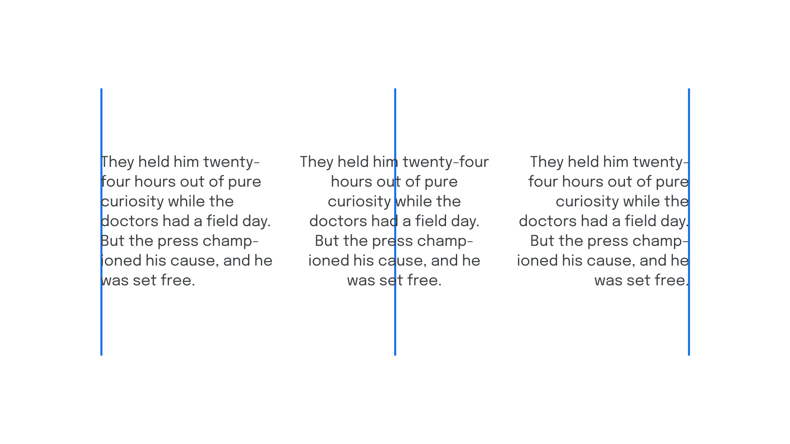
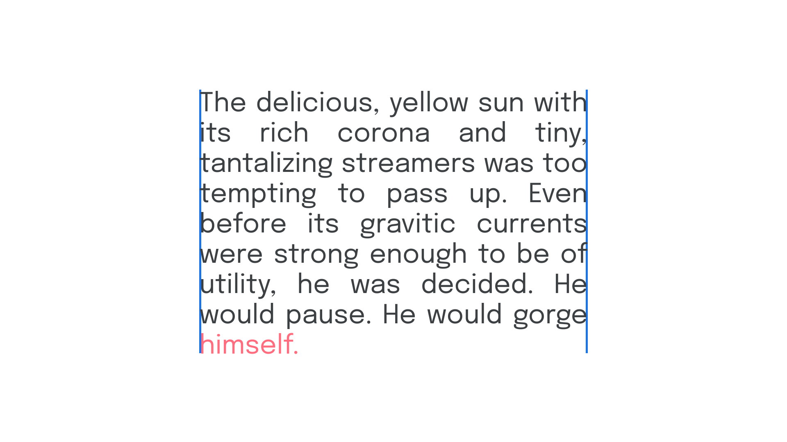

In paragraphs of (western) [text](/glossary/text_copy), alignment refers to the invisible vertical line(s) implied by a block of [type](/glossary/type), which aids readability. When type is left-aligned, each new line begins from the same point on the X axis.

<figure>

</figure>

If the text is right-aligned, the invisible vertical line sits to the right-hand side of the paragraph; if the text is center-aligned, the line sits in the center of the paragraph. It’s possible to have the text aligned to both left *and* right; this is known as justified text.

<figure>

</figure>

Because justification adds space between words, it often creates unsightly gaps and rivers in the text. This can be avoided with the liberal use of [hyphenation](/glossary/hyphenation) to avoid word spaces that are too wide or too long.

Justified text can appear neater because of its uniform alignment. However, the last line of a paragraph in justified text will not be justified; this makes the occurrence of [orphans](/glossary/widows_orphans) more problematic, since they interrupt this perceived neatness.
