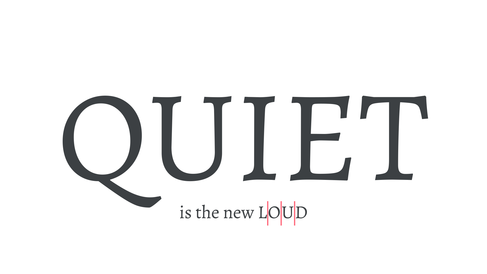

When [text](/glossary/text_copy) is set in only [uppercase](/glossary/uppercase_lowercase) letters, it’s commonly abbreviated as all-caps. All-caps text can be hard to read unless that text is very short, so it’s best to keep it brief, such as for titles or emphasis. Don’t use it for [body](/glossary/body) text. At any but the larger sizes, we often add additional [tracking/letter-spacing](/glossary/tracking_letter_spacing) to all-caps type that’s longer than two or three characters—this helps improve overall readability.

<figure>

<figcaption>The all-caps word “QUIET" set in large type requires no tracking. The all-caps word “LOUD"—set much smaller—has additional tracking to aid readability.</figcaption>

</figure>

If you have to use uppercase text within body text, consider using [small caps](/glossary/small_caps). Small caps are designed to feel more at home with the rest of the lowercase type and won't “shout” so much at the reader.
