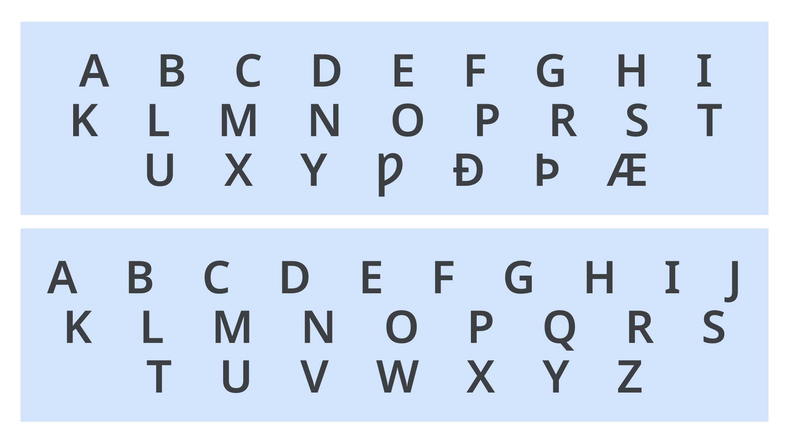

An alphabet typically refers to a [writing system](/glossary/script_writing_system) in which the elemental speech sounds of a language (phonemes) are represented by a set of graphical units, called [letters](/glossary/letters). An individual member of the set is called a letter.

<figure>

</figure>
<figcaption>Examples of the Old and Modern English alphabet.</figcaption>

In common typological classifications, linguists principally differentiate alphabets from other types of writing systems such as [syllabaries](https://en.wikipedia.org/wiki/Syllabary), where graphical units represent syllables, and logographies, where graphical units represent entire words (or other meaningful, decomposable units of language, called morphemes). 

In practice, however, writing systems frequently rely on more than one approach to represent language. For example, modern American English is written using both alphabetic letters and non-alphabetic symbols (e.g., 1, 2 , 3, @, &), many of which can be seen on standard computer keyboards.  
