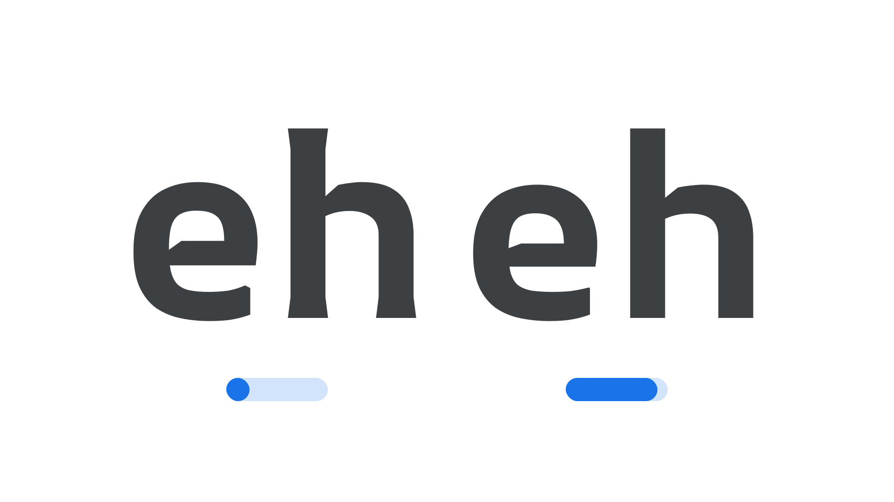

“AR Retinal Resolution” (`ARRR` in CSS) is an [axis](/glossary/axis_in_variable_fonts) found in some [variable fonts](/glossary/variable_fonts) that can be used to optimize text rendering across different resolutions. The axis range values represent PPD (Pixels Per Degree) units, which are directly related to the resolution of different AR headsets.

The [Google Fonts CSS v2 API](https://developers.google.com/fonts/docs/css2) defines the axis as:

| Default: | Min: | Max: | Step: |
| --- | --- | --- | --- |
| 10 | 10 | 60 | 1 |

<figure>

<figcaption>Typeface: [AR One Sans](https://fonts.google.com/specimen/AR+One+Sans)</figcaption>
</figure>

In practice, this means that parts of the [letterforms](/glossary/letterform)’ [strokes](/glossary/stroke) are tapered — either flaring out at the ends of stems, or (much like [ink traps](/glossary/ink_trap)) indenting where strokes meet. The primary goal of this axis is to ensure the quality of the reading experience is the same for users with low- and high-resolution headsets. Therefore, all adjustments are intended to make the text render appear equal to all users.