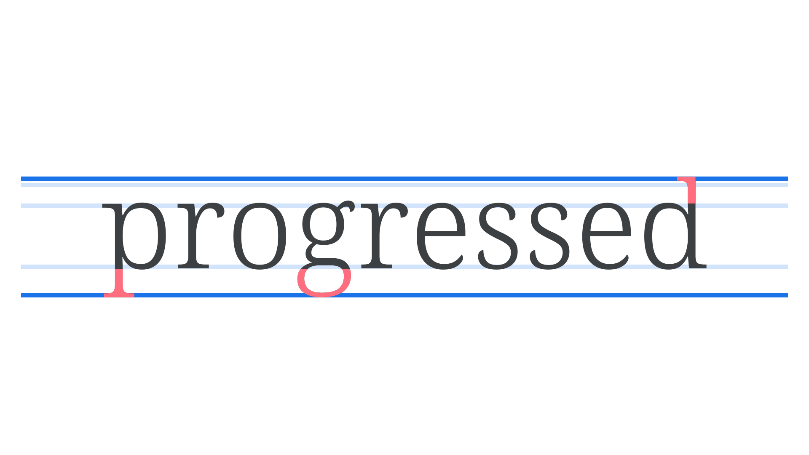
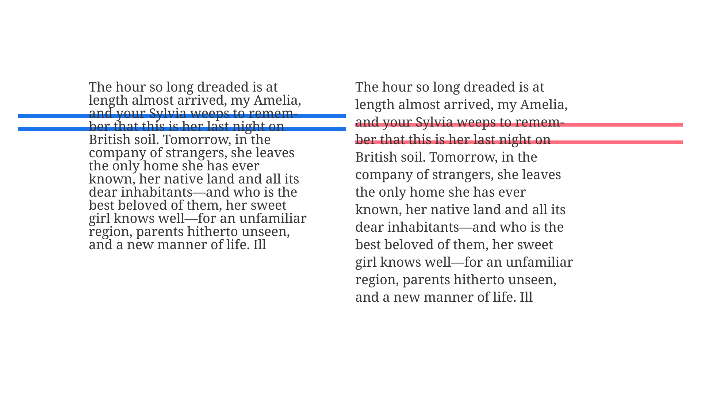

An ascender is an upward part of a letterform (often a vertical [stroke](/glossary/stroke)) that extends above the [x-height](/glossary/x_height) and usually above the [cap height](/glossary/cap_height), such as the stem of a lowercase b or d. A descender goes the other way: It’s a downward vertical stroke that extends below the [baseline](/glossary/baseline), such as the stem of a lowercase g or p.

<figure>

</figure>

Because very pronounced ascenders or descenders add to a typeface’s overall height, they effectively reduce the x-height. Similarly, if a typeface is said to have a high x-height, it’s usually safe to assume that it therefore has short ascenders and descenders.

<figure>

</figure>

In paragraph text, the interplay between the descenders of one line with the ascenders of the line below can be a good indicator of an appropriate [line height](/glossary/line_height_leading) setting. If they touch, the line height is too tight.

<figure>

</figure>
