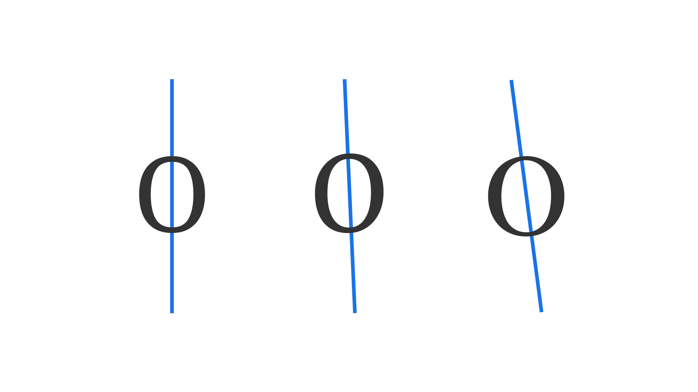

In [type design](/glossary/type_designer), the axis usually refers to the direction of the [stroke](/glossary/stroke) in a [letterform](/glossary/letterform), often taking inspiration from (or making direct reference to) how letterforms might appear if drawn with a [pen](/glossary/handwriting). Letterforms with slanted axes are informed by writing with a broad-nibbed pen (translation), while letterforms with vertical axes are informed by writing with a pointed pen (expansion). This is the basis of [Gerrit Noordzij’s theory and eponymous cube](https://typemedia.org/noordzij/).

<figure>

</figure>

It’s possible to infer the axis (or axes) in a [typeface](/glossary/typeface)’s design by the contrast of the thick and thin parts of a stroke; therefore, [low-contrast](/glossary/contrast) typefaces (i.e., most [sans serifs](/glossary/sans_serif)) don’t necessarily have a visible axis.
