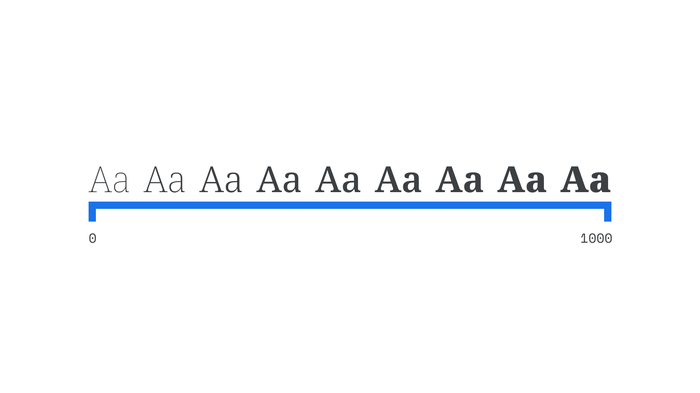

In [variable fonts](/glossary/variable_fonts), “axis” usually refers to a single aspect of a [typeface](/glossary/typeface)’s design that can be altered by the user.

<figure>

</figure>

Common axes include [Italic](/glossary/italic_axis), [Optical Size](/glossary/optical_size_axis), [Slant](/glossary/slant_axis), [Weight](/glossary/weight_axis), and [Width](/glossary/width_axis), all five of which are registered (defined) in the OpenType file format specification.

However, any property of a typeface’s design can be mapped to an axis—the choice is up to the [type designer](/glossary/type_designer). Using axes is always possible in CSS via the `font-variation-settings` attribute, while Weight can be controlled by `font-weight`, Width can be controlled by `font-stretch`, and Optical Size is automatically applied by `font-optical-sizing`.
