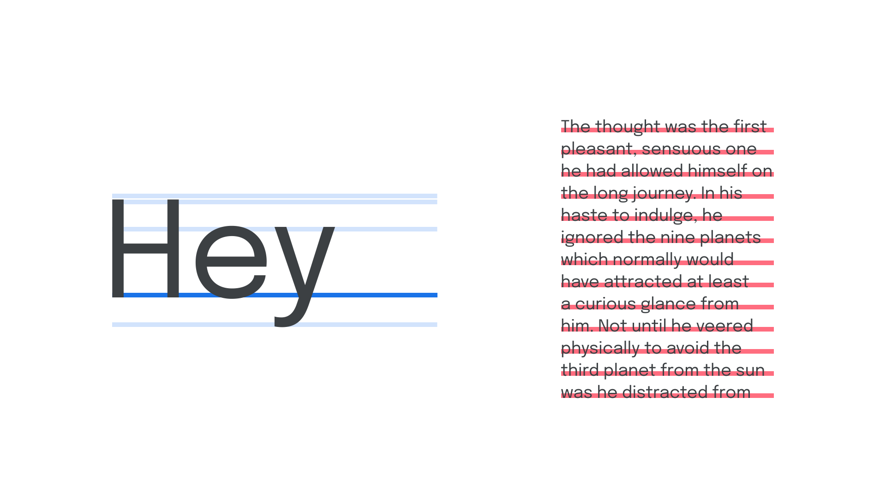

The baseline is the invisible line upon which letters rest. It’s used as a point from which other elements are measured, such as [line-height](/glossary/line_height_leading) and [x-height](/glossary/x_height).

<figure>

</figure>

A baseline grid refers to the vertical space between the baselines in a block of text; e.g. a 16 pixel baseline grid means there’s a baseline every 16 vertical pixels.
