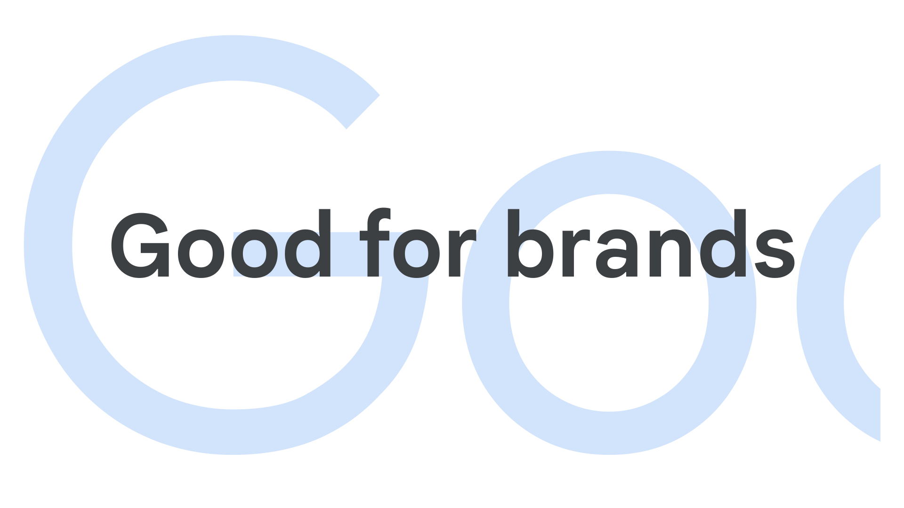

Bespoke or custom [type](/glossary/type) is specifically commissioned by a client, usually to serve as a brand typeface. It’s normally not available to the public.

<figure>

</figure>

Many [type foundries](/glossary/type_foundry) sell retail [fonts](/glossary/font) to the public and also offer bespoke/custom [type design](/glossary/type_designer) services. These can be completely unique [typefaces](/glossary/typeface), designed from the ground up for the client, or special adaptations of existing designs.

From a [licensing](/glossary/licensing) perspective, type foundries usually charge for the bespoke design work itself and then a special licensing fee on top. Although commissioning a bespoke typeface can be a costly exercise, the simplified licensing structure for large corporations is a potentially huge money saver.

Foundries may offer a license that allows them to sell the bespoke typefaces to the public as retail fonts after a certain period has passed.
