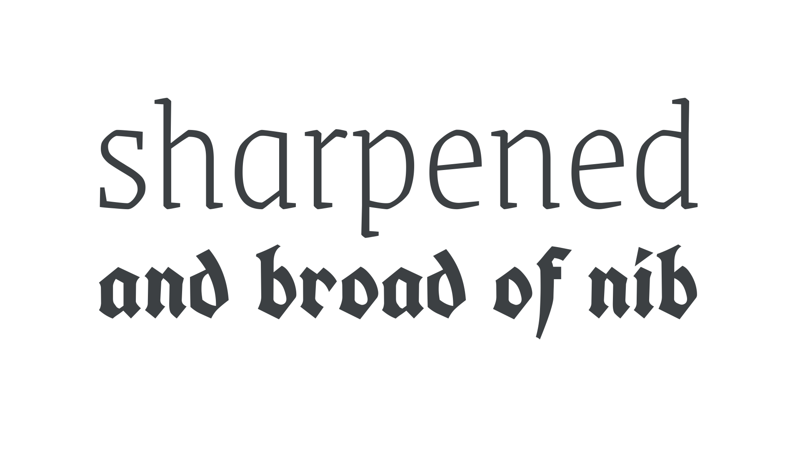

The Blackletter (also called Brokenscript) style is a historical [classification](/glossary/classification) that relates to [typefaces](/glossary/typeface) that initially arose—and/or became popular in—medieval Europe. Blackletter typefaces are also sometimes referred to as Frakturs, although Fraktur is a specific *style* of blackletter, as are Textura, Schwabacher, Rotunda, Bastarda, etc.

<figure>

</figure>

It’s important to note that, like all historical classifications, Blackletter typefaces that fit this style don’t necessarily come from this period in history.
