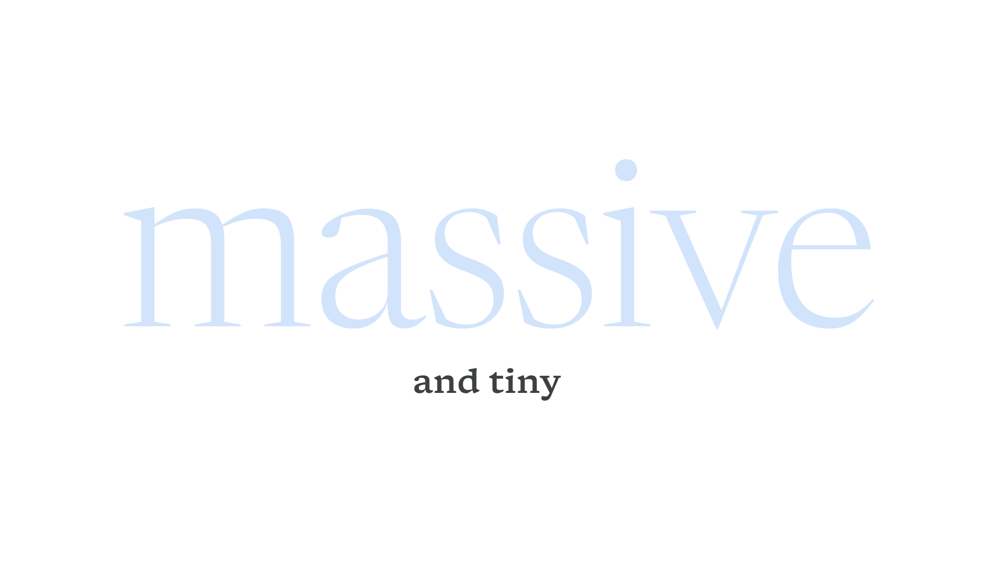

Body refers to either the main [text](/glossary/text_copy) in a piece of content—i.e., a “body of work”—or the “body” [optical size](/glossary/optical_sizes) (which serves as the opposite of “[display](/glossary/display)”).

<figure>

</figure>

Whether text is set in an actual “body” optical size or not (as optical sizes are not present in the vast majority of fonts), the body is usually the portion of the overall content that requires traits often found in that optical size: a focus on [legibility](/glossary/legibility_readability), a low [stroke](/glossary/stroke) [contrast](/glossary/contrast), a high [x-height](/glossary/x_height), and a font size of around 8 to 18 points/pixels.
