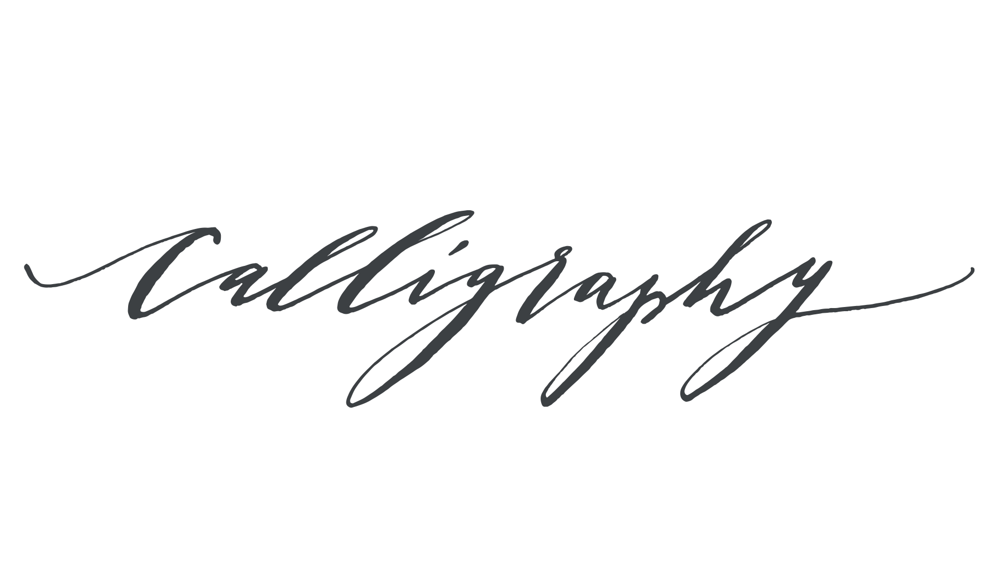

A halfway point between [handwriting](/glossary/handwriting) and [lettering](/glossary/lettering), calligraphy is the practice of writing with a deliberate and artful style, with a consistency across letterforms that is not entirely unlike [type](/glossary/type).

<figure>

<figcaption>

Calligraphy by [Mara Zepeda](http://www.neithersnow.com)

</figcaption>

</figure>

Jessica Hische says that “calligraphy is writing and lettering is drawing.” A calligrapher creates the letterforms as they write; a letterer first sketches or draws the letterforms before finishing and/or digitizing the lettering piece.

Calligraphic [typefaces](/glossary/typeface) attempt to create the illusion of calligraphy, often with the help of [OpenType](/glossary/open_type) features such as [swashes](/glossary/swash_glyph) or [contextual alternates](/glossary/alternates).
