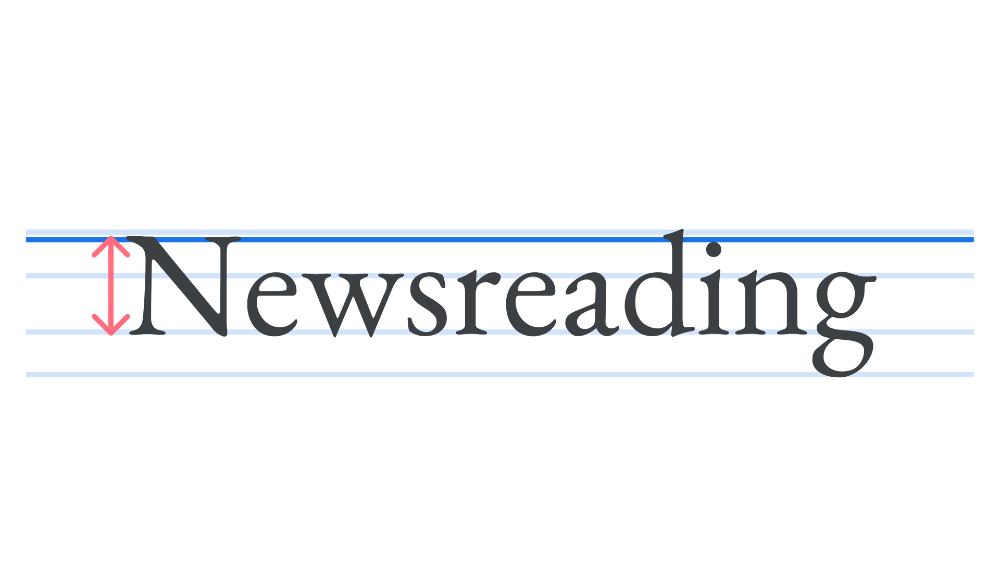

Cap height is the height of a [typeface](/glossary/typeface)’s [uppercase](/glossary/uppercase_lowercase) letters, measured from the [baseline](/glossary/baseline) to the top of flat-topped [glyphs](/glossary/glyph). This is usually slightly lower than the ascender height, and cap height can vary between typefaces.

<figure>

</figure>

Note that due to optical illusion, round and pointed capitals (for instance the O and A) will extend a little above the cap height to make them appear as tall as the flat-topped capitals.
