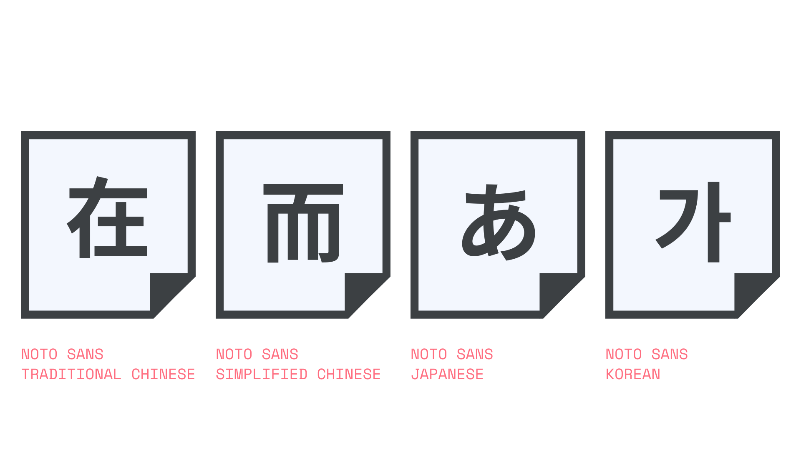

CJK is the shorthand collective name for the Chinese, Japanese, and Korean writing systems, all of which include Chinese characters and derivatives. The “C” represents both the traditional version and simplified version of Chinese; the “J” represents Japanese Hiragana, Katakana, and Kanji (the latter being Chinese characters used in Japanese); and the “K” represents the Korean Hangeul and Hanja (the latter being Chinese characters used in Korean).

<figure>

</figure>

These languages each have many thousands of characters and therefore their fonts also contain many glyphs (and Latin glyphs, too), which is why the individual writing systems—including the traditional and simplified versions of Chinese—are separated out into their own dedicated fonts, such as [Noto Sans Traditional Chinese](https://fonts.google.com/noto/specimen/Noto+Sans+TC). It’s unusual for a single CJK font to contain more than a single writing system.