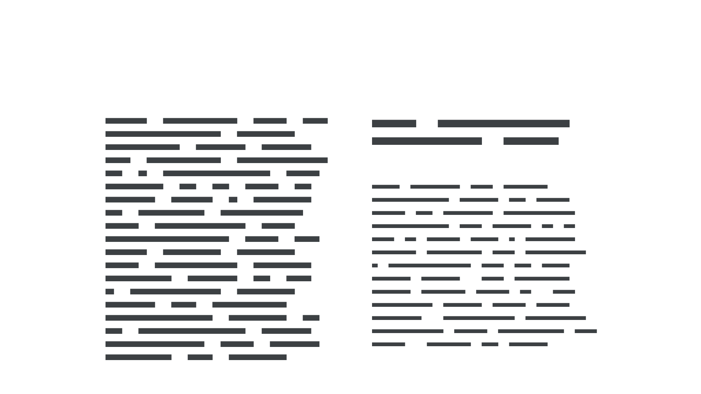

In [typography](/glossary/typography), color refers to the overall presence of type on a page—its lightness and darkness compared to the negative space—rather than literal color in the sense of a palette or swatch.

<figure>

</figure>

Changing a [typeface](/glossary/typeface), or the [weight](/glossary/weight), or the [line height](/glossary/line_height_leading), or any other [typographic treatment](/glossary/typesetting) could be said to affect the overall color of [type](/glossary/type) on the page.