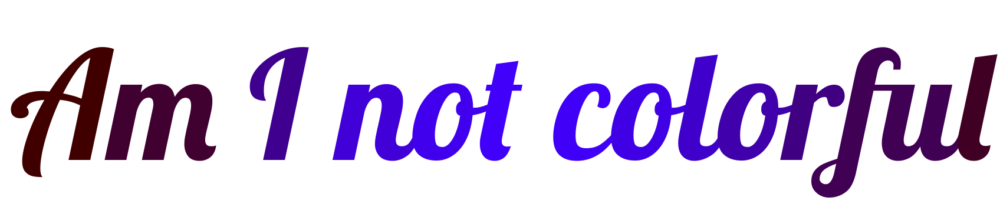

Color, or chromatic, fonts are fonts with two key capabilities non-color, or monochromatic, fonts don't have:

1. They can use many colors in a single glyph or character
1. The font specifies what the colors are
   * Though the user may override those colors

Contrast with a non-color, or monochromatic font which:

1. Can only draw in a single color
1. Cannot specify what the color is, only where "ink" goes
   * Some outside entity, such as CSS or a document editor sets the ink color

For example, below we see a monochromatic font default rendering:

<figcaption>A monochromatic font with no color assigned</figcaption>

Here is the same set of glyphs from the same font with the color of the ink changed for each glyph.

<figcaption>A monochromatic font with colors assigned to each glyph</figcaption>

The font had no input into these colors, it **only** defined where ink should be placed.

That's all well and good until we hit an example where:

1. A single glyph uses multiple colors
1. The colors have semantic meaning

The classic example, and the only color font most uses encounter at time of writing, is emoji.
This cannot be expressed using "put ink here," it needs multiple specific colors:

<figcaption>A glyph with multiple colors with semantic meaning</figcaption>

Sometimes we need more than simple filled areas. The gradients in this mango bring it to life:

<figcaption>A glyph with gradients</figcaption>

Sometimes we need color and gradients to make the best brackets ever made:

<figcaption>The world's best ornate brackets</figcaption>

Google Fonts offers a [collection](/?coloronly=true) of color fonts, including emoji, for you to play with.