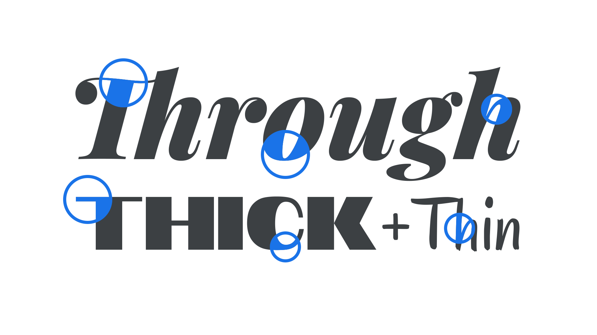

Contrast is the the difference between the thick and thin parts of a letterform’s [stroke](/glossary/stroke). A [monolinear](/glossary/monolinear) typeface has low stroke contrast, and is the opposite of a high-contrast face. A typical trait of a typeface with varying [optical sizes](/glossary/optical_sizes) is that [display](/glossary/display) sizes have higher contrast than [body](/glossary/body) sizes.

<figure>

</figure>

[Serifs](/glossary/serif) tend to have higher contrast strokes than [sans serifs](/glossary/sans_serif).
