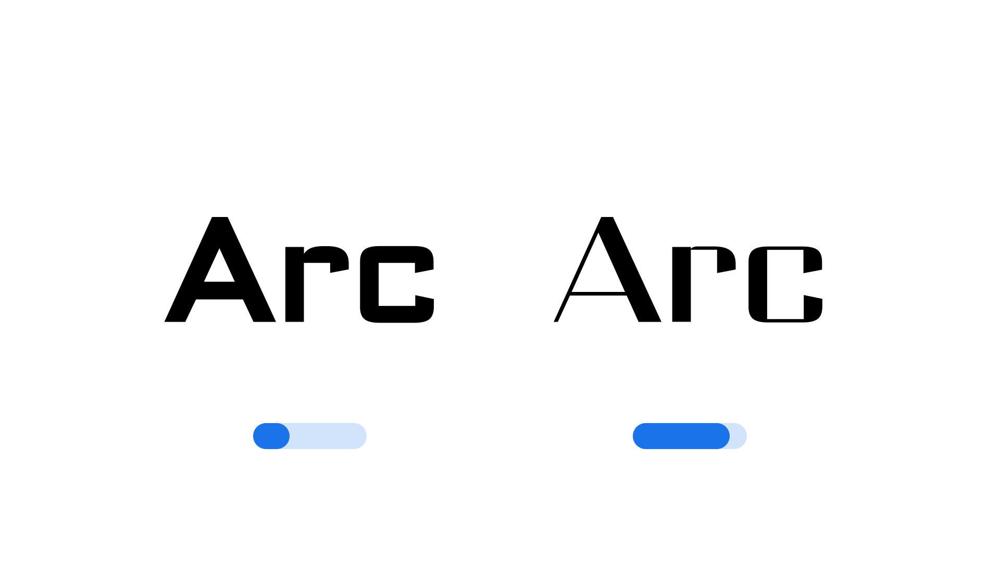

"Contrast" (`CTRS` in CSS) is an [axis](/glossary/axis_in_variable_fonts) found in some [variable fonts](/glossary/variable_fonts) that describes the stroke width difference between the thick and thin parts of [glyphs](/glossary/glyph). A value of zero indicates no visible or apparent contrast.

The [Google Fonts CSS v2 API](https://developers.google.com/fonts/docs/css2) defines the axis as:

| Default: | Min: | Max: | Step: |
| --- | --- | --- | --- |
| 0 | -100 | 100 | 1 |

Note that the default value is expected to differ per family, rather than be universally set for any implementation of this axis.

<figure>

<figcaption>The Contrast axis at its extremes, using the <a href="https://fonts.google.com/specimen/Science+Gothic">Science Gothic</a> font.</figcaption>

</figure>

A positive value increases contrast relative to the zero-contrast thickness by making the thin stroke thinner. At a value of 100, the thin stroke has the difference between the thin and thick is maximized.

A negative value indicates "reverse contrast": the strokes which would conventionally be thick in the writing system are instead made thinner. In western-language fonts, this might be perceived as a 19th-century, "circus" or "old West" effect. At a value of -100, the strokes which would normally be thick have disappeared completely.