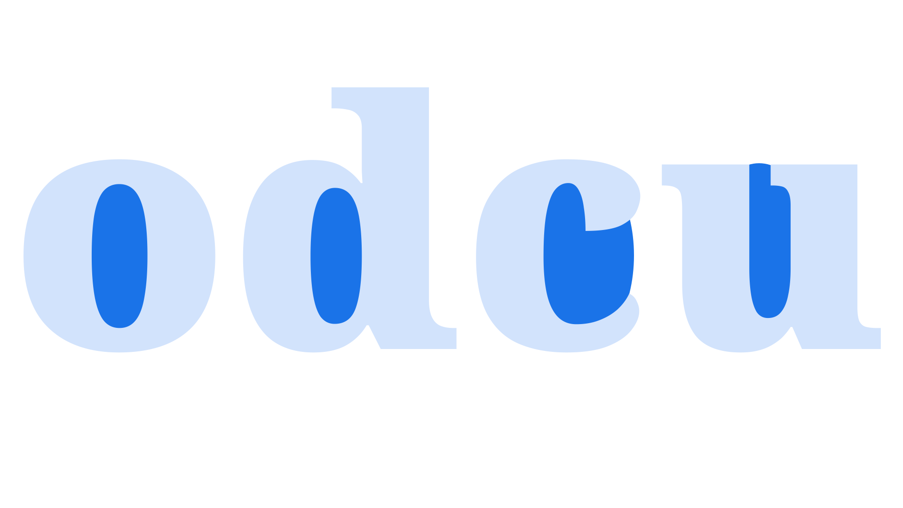

A counter, or counterform, is the transparent (negative or white) space enclosed inside a [letterform](/glossary/letterform). Counters can be closed, as in “o” and “d”, or open, as in “c” and “u.”

<figure>

</figure>

The name comes from the craft of traditional font production, in which a counterpunch makes indentations in the metal punch that is used for creating letter moulds. For more about this process, see [the “Punchcutting” entry on Wikipedia](https://en.wikipedia.org/wiki/Punchcutting).
