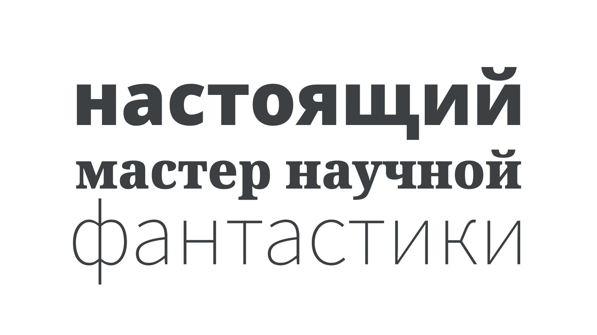

Cyrillic is the writing system used for Russian and various other languages across Eurasia and beyond, originally developed in the 10th century for speakers of the Proto-Slavic language.

<figure>

</figure>

So-called because of the missionary work of St. Cyril in the first Bulgarian Empire, the original Cyrillic script was based on uppercase Greek [letterforms](/glossary/letterform).
