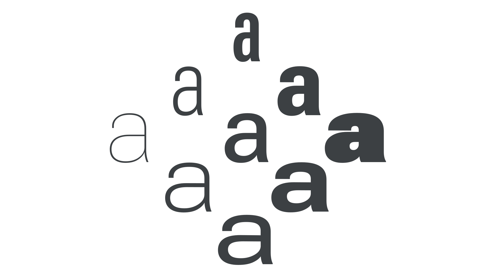

A designspace (sometimes written as “design space”) is a system specified during the [type](/glossary/type) design process that controls how a [variable font](/glossary/variable_fonts)’s appearance changes, via interpolation from the [master](/glossary/masters) designs and [glyph](/glossary/glyph) substitution, as its variation [axes](/glossary/axis_in_variable_fonts) are adjusted.

<figure>

</figure>

Each variation axis can be conceived as a dimension in the font’s designspace, so each distinct set of axis values implies a unique location in the designspace, and each unique location results in a unique [instance](/glossary/instance). For example, a variable font with [Weight](/glossary/weight_axis) and [Width](/glossary/width_axis) axes has a two-dimensional designspace, containing all variants of Weight and Width. Some advanced variable fonts, such as [parametric fonts](/glossary/parametric_font), have 10 or more axes; therefore they have designspaces of 10 or more dimensions.
