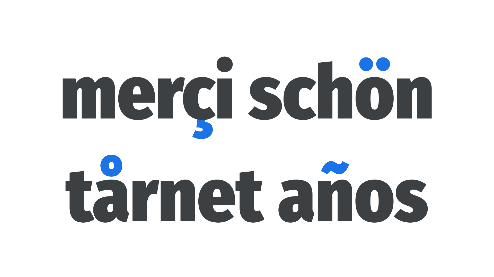

Diacritics are small marks that appear above or below [glyphs](/glossary/glyph), usually to alter pronunciation. They’re required in many languages, and we must ensure the [typeface](/glossary/typeface) we’re using includes the diacritics we need for all the languages we need to typeset. Polish, Welsh, and Turkish, for instance, have diacritics absent from many common [fonts](/glossary/font).

<figure>

</figure>

In the French language, pronunciation of the “e” in a word differs depending on whether it appears without a diacritic, with the acute accent (é), or with the grave accent (è).

Diacritics shouldn’t be confused with so-called “foreign” [characters](/glossary/character); i.e., those not common in English. Diacritics refer only to the extra marks above or below the character, not the entire glyph as a whole. For instance, the Nordic letter “ø” is not simply an “o” with a diagonal bar added as a diacritic—it’s a unique character in itself. (Of course, in terms of its construction by the [type designer](/glossary/type_designer), it would usually be based on the forms of the “o” character in the typeface.)
