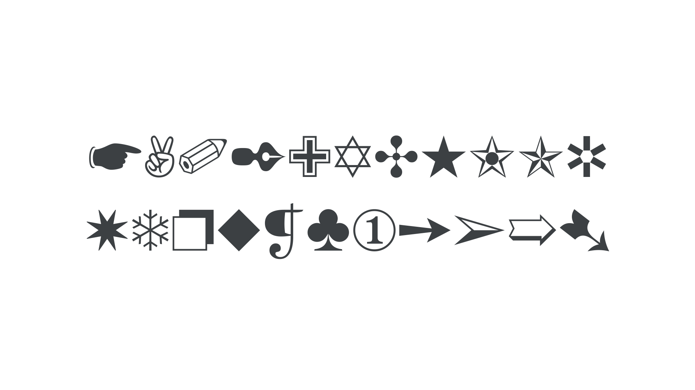

A dingbat is a [glyph](/glossary/glyph) that is not a letter, number, or form of punctuation. Most dingbats are pictograms: simple graphical representations contained in a [typeface](/glossary/typeface), borrowing characteristics from the main [characters](/glossary/character).

<figure>

</figure>

By referencing elements of the alphanumeric characters, it’s possible for dingbats to appear alongside them harmoniously. For instance, when using ornamental dingbats, the angle and width of the [stroke](/glossary/stroke) is usually shared across the dingbats and alphanumeric characters.
