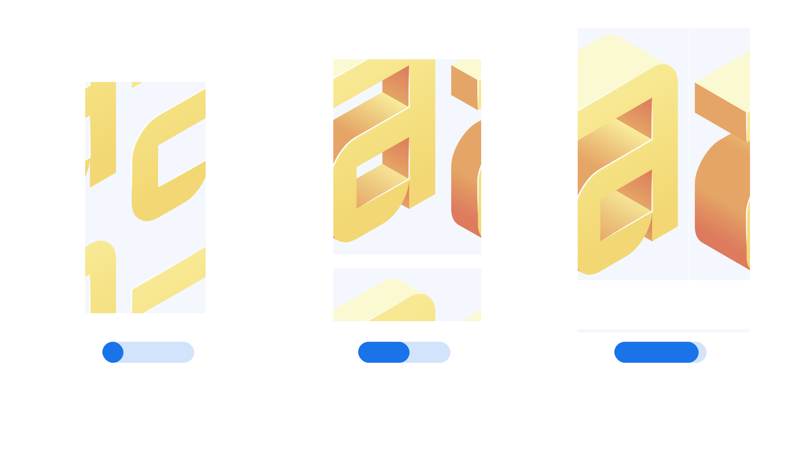

“Extrusion Depth” (`EDPT` in CSS) is an [axis](/glossary/axis_in_variable_fonts) found in some [variable fonts](/glossary/variable_fonts) that can be used to control the depth of three-dimensional letterforms. Values are in thousandths of an [em](/glossary/em) (the current font size). For example, setting Extrusion Depth to 500 will result in a 50%-of-the-em extrusion, which would be 20 px if the font size is set to 40 px.

The [Google Fonts CSS v2 API](https://developers.google.com/fonts/docs/css2) defines the axis as:

| Default: | Min: | Max: | Step: |
| -------- | ---- | ---- | ----- |
| 100      | 0    | 1000 | 1     |

Note that the default value is expected to differ per family, rather than be universally set for any implementation of this axis.

<figure>

<figcaption>Note the two-dimensional appearance when the axis is set to 0 when using the <a href="https://fonts.google.com/specimen/Nabla">Nabla</a> font.</figcaption>

</figure>

The axis was first used in the [Nabla font](https://fonts.google.com/specimen/Nabla) [color font](/glossary/color_fonts), which uses isometric perspective to achieve its three-dimensional look. The extrusion depth, at its maximum setting, creates a deeper or thicker letterform. At its minimum setting, the letterform appears only two-dimensional.
