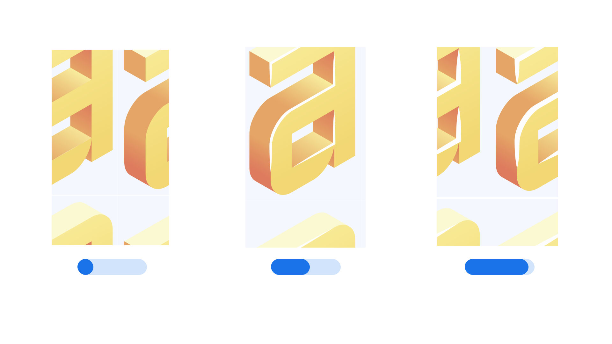

“Edge Highlight” (EHLT in CSS) is an axis found in some variable fonts that can be used to control the thickness of the highlighted part of edges in three-dimensional letterforms. Values are in thousandths of an em (the current font size). For example, setting Extrusion Depth to 500 will result in a 50%-of-the-em extrusion, which would be 20 px if the font size is set to 40 px.

The [Google Fonts CSS v2 API ](https://developers.google.com/fonts/docs/css2) defines the axis as:

| Default: | Min: | Max: | Step: |
| --- | --- | --- | --- |
| 12 | 0 | 1000 | 1 |

Note that the default value is expected to differ per family, rather than be universally set for any implementation of this axis.

<figure>

</figure>

The axis was first used in the Nabla color font, which uses isometric perspective to achieve its three-dimensional look. The highlighted edge, at its maximum setting, creates greater contrast between the face of the letterform and its extrusion. And, like all components of a color font, can be recolored from its white default.
