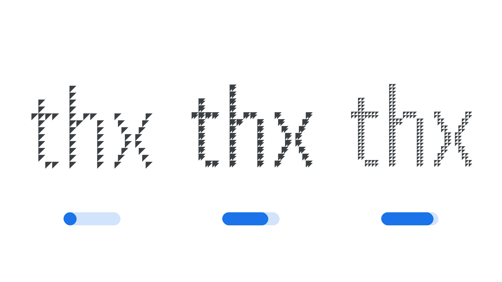

PARA1_TBC

The [Google Fonts CSS v2 API ](https://developers.google.com/fonts/docs/css2) defines the axis as:

| Default: | Min: | Max: | Step: |
| --- | --- | --- | --- |
| 0 | 0 | 0 | 0 |

<figure>

</figure>

PARA2_TBC