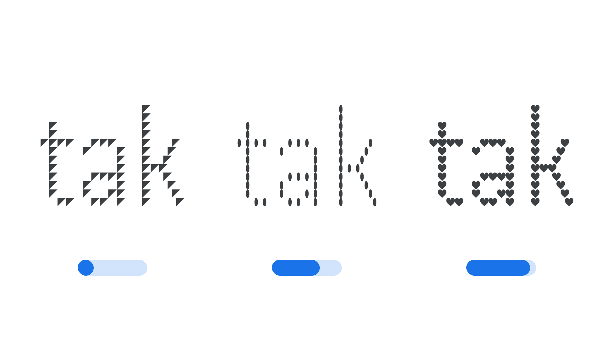

“Element Shape” (ELSH in CSS) is an axis found in some modular variable fonts where letterforms are composed using multiple copies of the same element. In these fonts, the Element Shape axis controls the shape of the element. The element can “snap” from one shape to another, or gradually morph between each one.

The [Google Fonts CSS v2 API ](https://developers.google.com/fonts/docs/css2) defines the axis as:

| Default: | Min: | Max: | Step: |
| --- | --- | --- | --- |
| 0 | 0 | 100 | 0.1 |

<figure>

</figure>

As with the Element Grid axis, Element Shape alters the structure of the letterforms in a way that may change the minimum font size at which the typeface is legible.

The axis tag starts with `EL`, which is an abbreviation of ‘Element’. This prefix is used for the group of axes (ELSH, ELGR, ELXP) related to modular typefaces — those with glyphs composed of elements.

This axis was first introduced in the Handjet typeface.