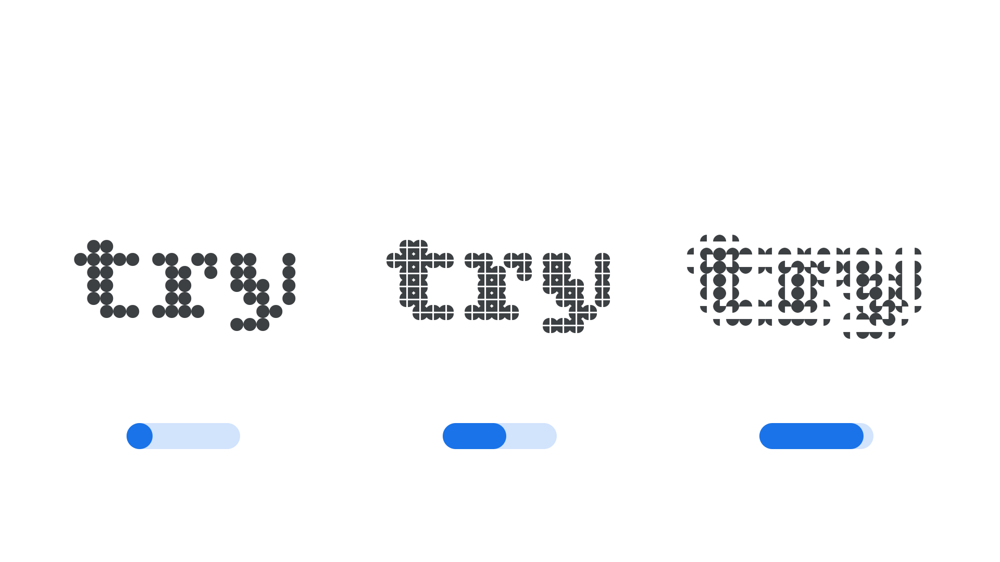

“Element Expansion” (`ELXP` in CSS) is an [axis](/glossary/axis_in_variable_fonts) found in some modular [variable fonts](/glossary/variable_fonts) where [letterforms](/glossary/letterform) are composed using multiple copies of the same element. In these fonts, the Element Expansion axis controls how far apart those elements sit from one another.

The [Google Fonts CSS v2 API](https://developers.google.com/fonts/docs/css2) defines the axis as:

| Default: | Min: | Max: | Step: |
| --- | --- | --- | --- |
| 0 | 0 | 100 | 1 |

<figure>

<figcaption>Typeface: <a href="https://fonts.google.com/specimen/Bitcount">Bitcount</a></figcaption>

</figure>

As the Element Expansion axis moves from its default towards its maximum, the elements that make up each [glyph](/glossary/glyph) move apart from one another, opening up gaps within the letterforms without changing how many elements are used to construct them.

As with the [Element Grid](/glossary/elgr_axis) and [Element Shape](/glossary/elsh_axis) axes, Element Expansion alters the structure of the letterforms in a way that may change the minimum font size at which the typeface is legible. These axes can be combined to produce a wide range of visual effects.

The axis tag starts with `EL`, which is an abbreviation of ‘Element’. This prefix is used for the group of axes (ELSH, ELGR, ELXP) that are related to modular typefaces — those with glyphs composed of elements.

This axis was first introduced in the [Bitcount](https://fonts.google.com/specimen/Bitcount) typeface.
