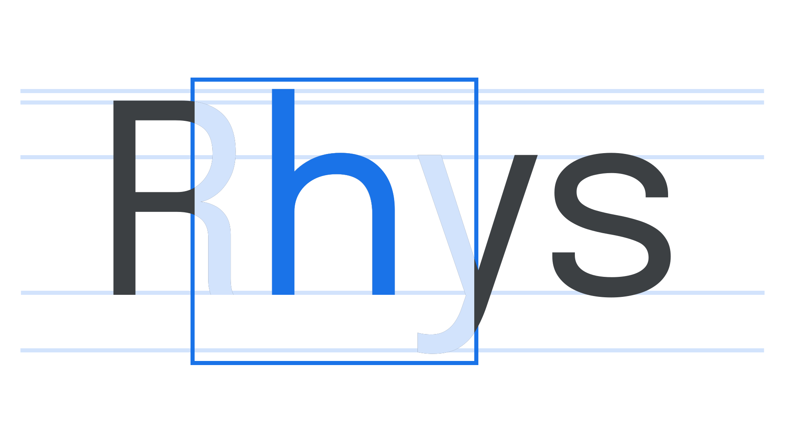
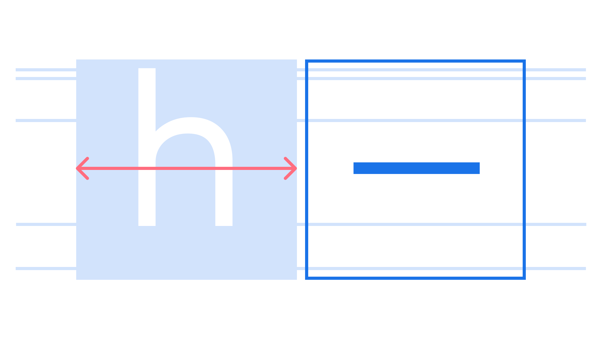

An em is a [unit](/glossary/unit) of measurement, relative to the size of the [font](/glossary/font); therefore, in a [typeface](/glossary/typeface) set at a `font-size` of 16px, one em is 16px.

The em square is the “box” that each [glyph](/glossary/glyph) is sized relative to. So, at 12 points, the em square is 12 points wide. The boundary of the box typically sits slightly above the cap-height and slightly below the descender.

<figure>

</figure>

The [em dash](/glossary/dashes) is so named because its width, in theory, is one em—although in many fonts the em dash is somewhat narrower. An [*en* dash](/glossary/en) takes up approximately half the space of an em square.

<figure>

</figure>

Historically, the em unit itself was named after the width of the capital “M;” however, in any digital font, the “M” may be wider or narrower than the em square of that font.
