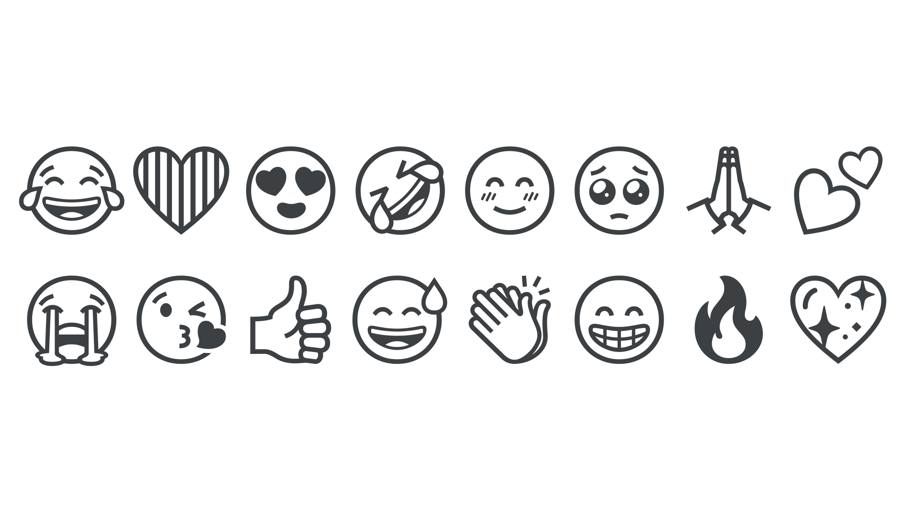

An emoji is a pictogram intended to convey emotional meaning, usually used as a supplement to [text](/glossary/text_copy) in order to clarify intent (for example, a “winking face” emoji to signify sarcasm) or instead of emotive text (for example, a “thumbs up” emoji as an affirmative response). Although sometimes referred to as “smileys” due to the many facial expressions available as emoji, the full range of emoji is much larger than facial expressions.

The emoji are successors to the original smileys, or emoticons: A sequence of punctuation glyphs to imitate an expression, such as a semi-colon and right parenthesis used to convey a wink ;)

<figure>

</figure>

The complete set (over 1,874 in version 15) is defined by the [Unicode](/glossary/unicode) Consortium with contributions from hardware and software makers, as well as communications specialists. Unicode assigns each emoji a number known as a code point, allowing devices to treat emoji as characters in a font — and indeed modern operating systems have emoji fonts built in. Each maker designs emoji in their own style, so the smiley face character on an Apple device is different from the smiley face in Windows or Android.

Depending on the system, it may be possible to override the default emoji [font](/glossary/font) and achieve cross-platform consistency. For example, on a website with a monochrome style, a designer might choose the black and white [Noto Emoji](https://fonts.google.com/noto/specimen/Noto+Emoji).