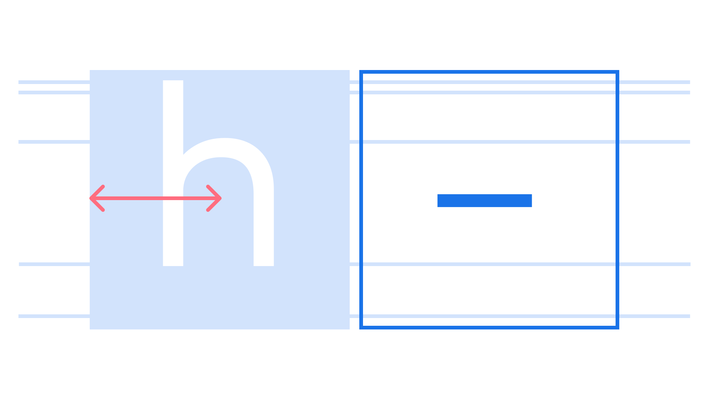

An en is a [unit](/glossary/unit) of measurement, half the size of an [em](/glossary/em), relative to the size of the [font](/glossary/font); therefore, in a [typeface](/glossary/typeface) set at a `font-size` of 16px, one en is 8px.

<figure>

</figure>

The [en dash](/glossary/dashes) is so named because its width, in theory, is one en—although in many fonts the en dash is somewhat narrower. 