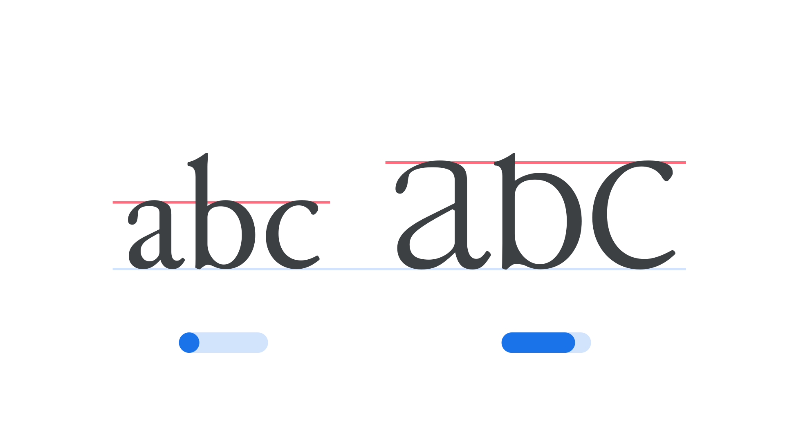

“Enlarge” (`ENLA` in CSS) is an [axis](/glossary/axis_in_variable_fonts) found in some [variable fonts](/glossary/variable_fonts) that scales certain [lowercase](/glossary/uppercase_lowercase) letters up to a size between ordinary lowercase and full [capitals](/glossary/cap_height). It’s modeled on “enlarged minuscules”: lowercase-shaped letters set larger than the surrounding text, which medieval scribes used to mark the start of a sentence.

The [Google Fonts CSS v2 API](https://developers.google.com/fonts/docs/css2) defines the axis as:

| Default: | Min: | Max: | Step: |
| --- | --- | --- | --- |
| 0 | 0 | 100 | 0.01 |

<figure>

<figcaption>Typeface: Junicode</figcaption>

</figure>

At 0 (Normal), the affected letters render at their ordinary lowercase size. At 100 (Enlarged), they grow to a height between the [x-height](/glossary/x_height) and the [cap height](/glossary/cap_height). Rather than simply scaling up a lowercase [glyph](/glossary/glyph)—which would make its [strokes](/glossary/stroke) look too heavy next to the surrounding text—moving along the Enlarge axis reshapes each letter’s proportions so its stroke weight stays consistent with the rest of the [typeface](/glossary/typeface).

The axis is intended for sentence-initial letters, echoing a convention found in medieval manuscripts, but it can be applied to any [character](/glossary/character) for a similar effect.

This axis was first introduced in the Junicode typeface, a font designed for medievalists, linguists, and other scholars.
