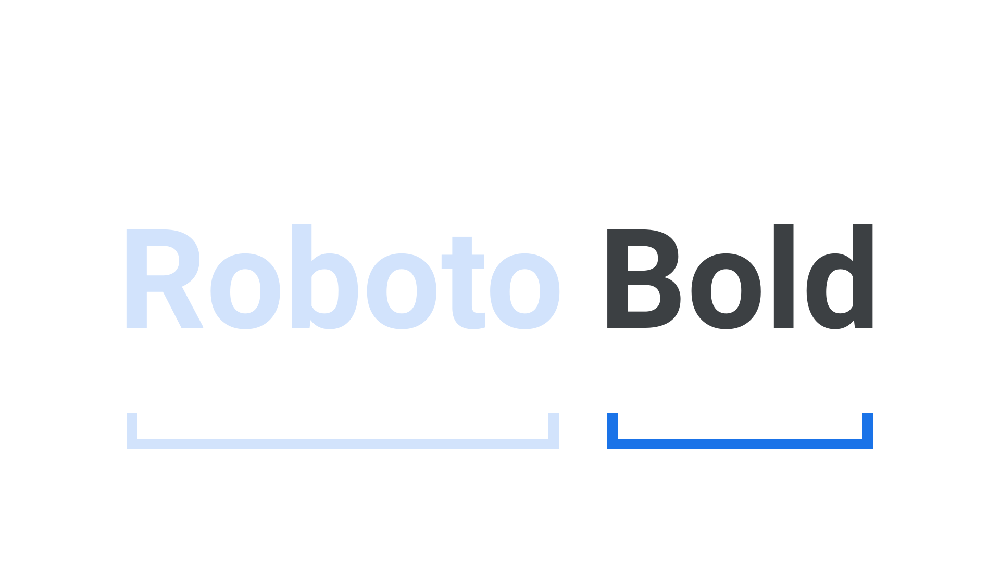

A [typeface](/glossary/typeface) is the underlying visual design that can exist in many different typesetting technologies and a font is one of these implementations. In other words, a typeface is what you see and a font is what you use.

Decades of choosing type via software “font” menus has caused the majority of us to think of “font” and “typeface” as interchangeable terms for the same thing, but the difference is important for anyone serious about [typography](/glossary/typography). Another useful analogy is that a typeface is to a song as a font is to an MP3 file: It’s a manifestation of the typeface/song, but the typeface/song exists outside of the format.

<figure>

</figure>

Fonts aren’t limited to the digital domain, either. The term “fonts” has always been used to describe an instance of a particular weight or style of a typeface. To put that into practice, consider that [Roboto](https://fonts.google.com/specimen/Roboto) is a typeface and Roboto Bold is a font.
