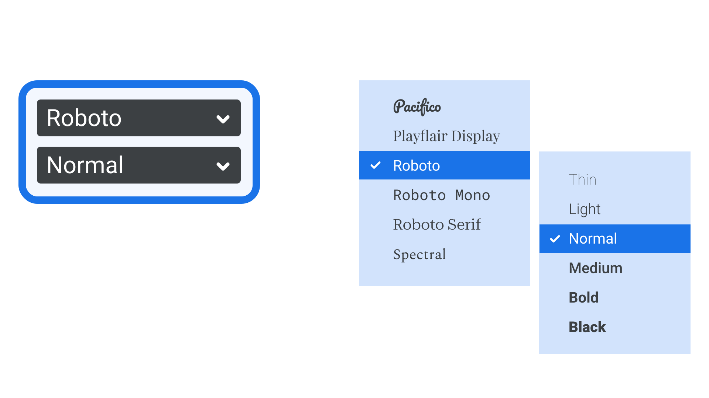

The [font](/glossary/font) picker is the part of a user interface that specifically allows the user to choose a font. Most commonly, this incorporates a scrollable dropdown list of available fonts, often with a sub-menu or secondary dropdown for picking particular instances, such as [weights](/glossary/weight) and [styles](/glossary/style).

<figure>

<figcaption>On the left: A Font menu similar to the one in many design applications, with a dropdown for the typeface on the top, followed by a dropdown for weights and styles beneath. On the right: A pop-out sub-menu for weights and styles, as seen in Google Workspace apps.</figcaption>

</figure>

Depending on the software, the font picker may show the list of fonts with their names set in either the standard [typeface](/glossary/typeface) for that UI, each in their own typeface, or a combination of a regular list augmented with a preview. Some apps, such as those in Adobe’s Creative Cloud and Microsoft Word, also have the ability to automatically update the selected text on the canvas, as the user scrolls through the list in the font picker.
