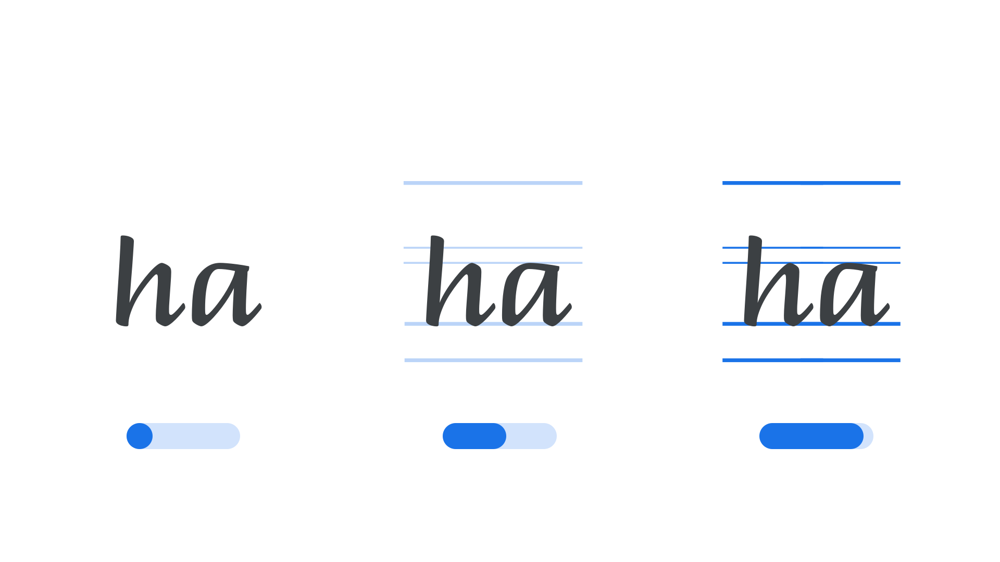

“Guides Opacity” (`GDOP` in CSS) is an [axis](/glossary/axis_in_variable_fonts) found in some [variable fonts](/glossary/variable_fonts) that adjusts the visibility of guide marks built into the [glyphs](/glossary/glyph) themselves. These guides—reference [strokes](/glossary/stroke) such as ruled lines and dotted paths—are often included in [handwriting](/glossary/handwriting)-style typefaces to show how a letter is meant to be formed.

The [Google Fonts CSS v2 API](https://developers.google.com/fonts/docs/css2) defines the axis as:

| Default: | Min: | Max: | Step: |
| --- | --- | --- | --- |
| 100 | 0 | 100 | 1 |

<figure>

<figcaption>Typeface: <a href="https://fonts.google.com/specimen/Briem+Hand">Briem Hand</a></figcaption>

</figure>

At its default value of 100, the guides are fully visible, which is useful for teaching or demonstrating how a [script](/glossary/script_typeface_style) or handwriting typeface is meant to be written. Moving the axis down to 0 fades the guides out completely, leaving only the ordinary letterforms behind—suited to regular reading and setting text.

Unlike most axes in the registry, Guides Opacity defaults to its maximum rather than its minimum value, so that the guides are shown unless a user deliberately hides them.
