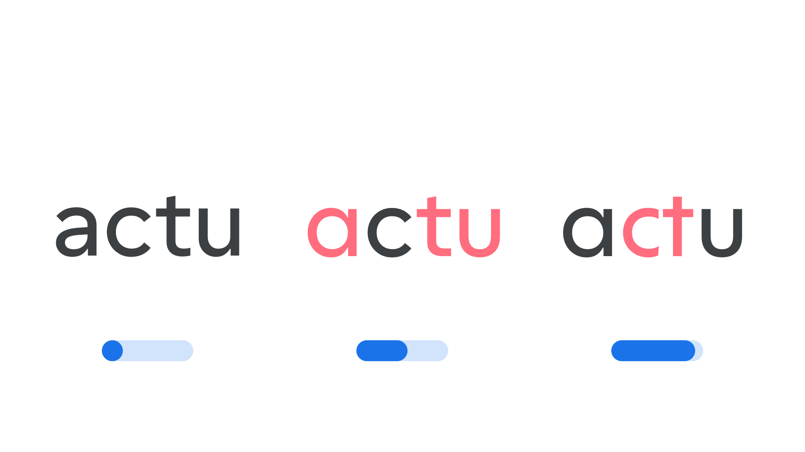

“Geometric Form” (`GEOM` in CSS) is an [axis](/glossary/axis_in_variable_fonts) found in some [variable fonts](/glossary/variable_fonts) that transforms [letterforms](/glossary/letterform) from their default construction into simplified [geometric](/glossary/geometric) shapes—circles, triangles, and squares. Depending on the [typeface](/glossary/typeface), this transition can happen through a gradual reshaping of the [glyphs](/glossary/glyph), through character swaps at set points along the axis, or a combination of both.

The [Google Fonts CSS v2 API](https://developers.google.com/fonts/docs/css2) defines the axis as:

| Default: | Min: | Max: | Step: |
| --- | --- | --- | --- |
| 0 | 0 | 100 | 10 |

<figure>

<figcaption>Typeface: <a href="https://fonts.google.com/specimen/Cal+Sans">Cal Sans</a></figcaption>

</figure>

At 0, letterforms keep their regular, default construction. As the axis increases towards 100, details are progressively simplified until the [strokes](/glossary/stroke) resolve into the plain geometric shapes underlying the [typeface](/glossary/typeface)’s design. Because the axis moves in fixed increments rather than a smooth continuum, some typefaces use it to switch cleanly between a small number of named styles rather than blend infinitely between them.

This axis is best suited to [display](/glossary/display) typefaces, since strongly geometric letterforms can reduce [readability](/glossary/readability) at smaller sizes.
