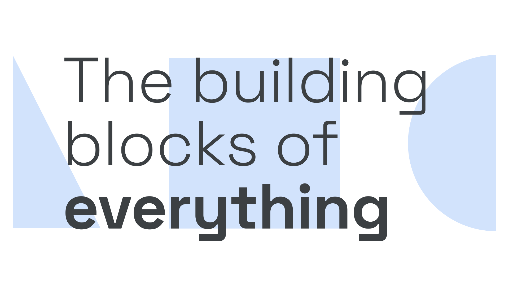

“Geometric” is a genre (and sometimes historical) [classification](/glossary/classification) of [typefaces](/glossary/typeface)—almost always [sans serifs](/glossary/sans_serif)—so called because of their geometric construction: the circles, triangles, and straight lines that form the core shapes of their [letterforms](/glossary/letterform).

<figure>

</figure>

Examples of Geometric typefaces include [DM Sans](https://fonts.google.com/specimen/DM+Sans), [Poppins](https://fonts.google.com/specimen/Poppins), and [Raleway](https://fonts.google.com/specimen/Raleway?query=raleway). The repeating, similar shapes within these typefaces can hinder readability, making them less ideal for body text.

It should be noted that even typical Geometric typefaces are not entirely geometric in construction: For us to perceive something as perfectly geometric, it’s necessary for the type designer to apply optical corrections. Overshoots, ovals instead of perfect circles, horizontals at 90% thickness of the verticals, crossbars above the midpoint, etc., are all still present in geometric faces.

Geometric typefaces became popular in the early 20th century and enjoyed a resurgence in the 1970s and 1980s. Geometric typefaces don’t necessarily come from these periods in history.
