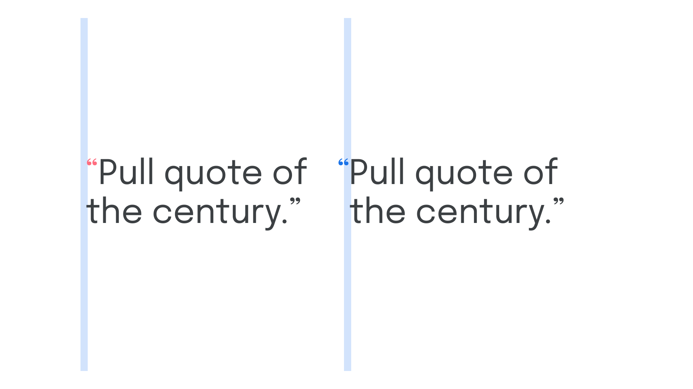

Hanging punctuation refers to punctuation marks that appear outside of a [text](/glossary/alignment_justification) frame (usually to the left in left-aligned, left-to-right text) to create a more pleasing vertical [rhythm](/glossary/rhythm).

<figure>

</figure>

By moving punctuation marks outside of their designated space and into the (usually left) margin,  the content itself appears to be visually aligned along the (usually left) edge. For pull quotes, for instance, the opening quotation marks create an optical indentation that disrupts the rhythm of the page. This can be improved by moving that opening quotation mark into the negative space that exists just outside of the text frame.
