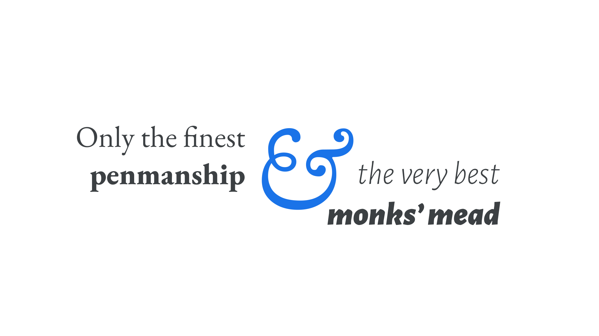

“Humanist” or “Old Style” is a historical [classification](/glossary/classification) for [typefaces](/glossary/typeface) that draw inspiration from Roman [lettering](/glossary/lettering) and the Carolingian minuscule (a standardized form of [calligraphy](/glossary/calligraphy)) to include forms that reference the [stroke](/glossary/stroke) of a pen.

Nicolas Jenson printed the first books using a Humanist [serif](/glossary/serif) typeface. He was inspired by the simple handwriting of the Italian Humanists, who—challenged by the ornamentation of Gutenberg's Textura [Blackletter](/glossary/blackletter)—developed a style that enabled them to copy manuscripts more quickly.

Although initially a grouping for serif types, it’s also possible to have [sans serifs](/glossary/sans_serif) that exhibit a humanist style.

<figure>

</figure>

Humanist typefaces declined in use in the 18th and 19th centuries, but enjoyed a major revival in the 20th century and remain popular type choices today.

Examples of serif Humanist typefaces include [Spectral](https://fonts.google.com/specimen/Spectral), [EB Garamond](https://fonts.google.com/specimen/EB+Garamond?category=Serif&sort=popularity#glyphs), and [Sorts Mill Goudy](https://fonts.google.com/specimen/Sorts+Mill+Goudy); examples of sans serif Humanist typefaces include [Merriweather Sans](https://fonts.google.com/specimen/Merriweather+Sans) and [Cabin](https://fonts.google.com/specimen/Cabin).
