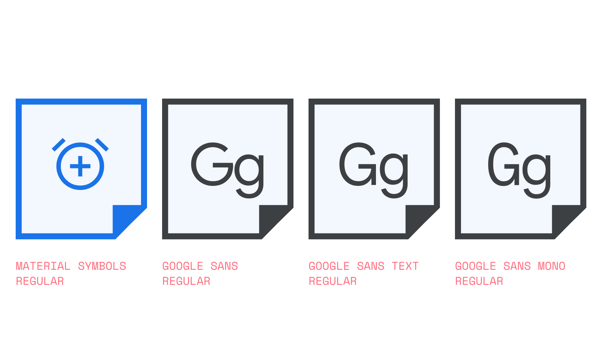

An icon [font](/glossary/font) is a font that exclusively contains icon [glyphs](/glossary/glyph) rather than alphanumeric glyphs. A couple of examples are [Material Icons](https://fonts.google.com/icons?icon.set=Material+Icons) and [Material Symbols](https://fonts.google.com/icons?icon.set=Material+Symbols)—both are icon fonts, although Material Symbols is a [variable font](/glossary/variable_fonts), allowing for fine-tuning via variable [axes](/glossary/axis_in_variable_fonts).

<figure>

</figure>

Using fonts to render icons has multiple benefits:

- Being vector-based, they’re infinitely scalable, unlike rasterized images.
- Contained in one file, the file size is considerably smaller than a collection of individual images—even vector-based ones.
- When used on the web, they can be colored and positioned using just CSS, and browser support is excellent.
- When using variable icon fonts, they’re customizable in a way that allows them to be more closely matched to any accompanying type.
