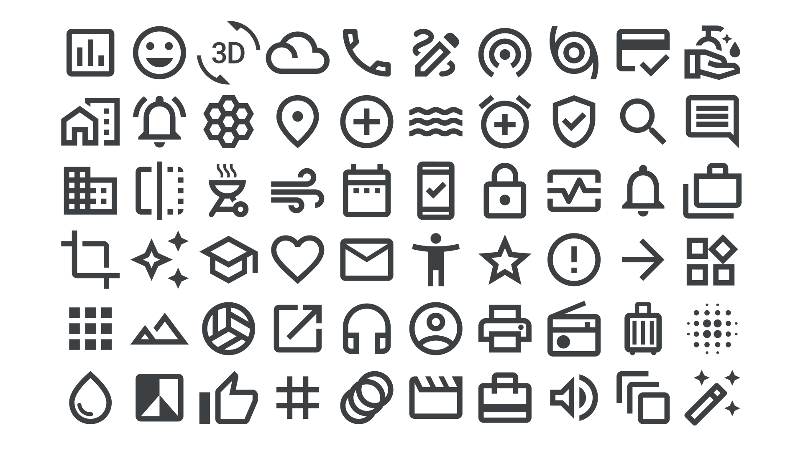

“Icon” and “symbol” are terms that we often use interchangeably, but there’s actually a subtle difference: An icon is a literal, visual representation of the thing it represents, whereas a symbol can be a more abstract representation of something. For example, a hand accompanied by direction arrows is an icon; it represents a person’s finger swiping. A cog wheel is a symbol; it represents the idea of changing settings.

<figure>

</figure>

Some icons that were once literal representations have, over time, come to take on a more symbolic form, such as the floppy disk that’s usually used as a “save” icon in software. Even more abstract is the symbol consisting of three stacked horizontal lines, which has come to represent a navigation menu.

Icons and symbols are combined in the [icon fonts](/glossary/icon_font) provided by Google Fonts.
