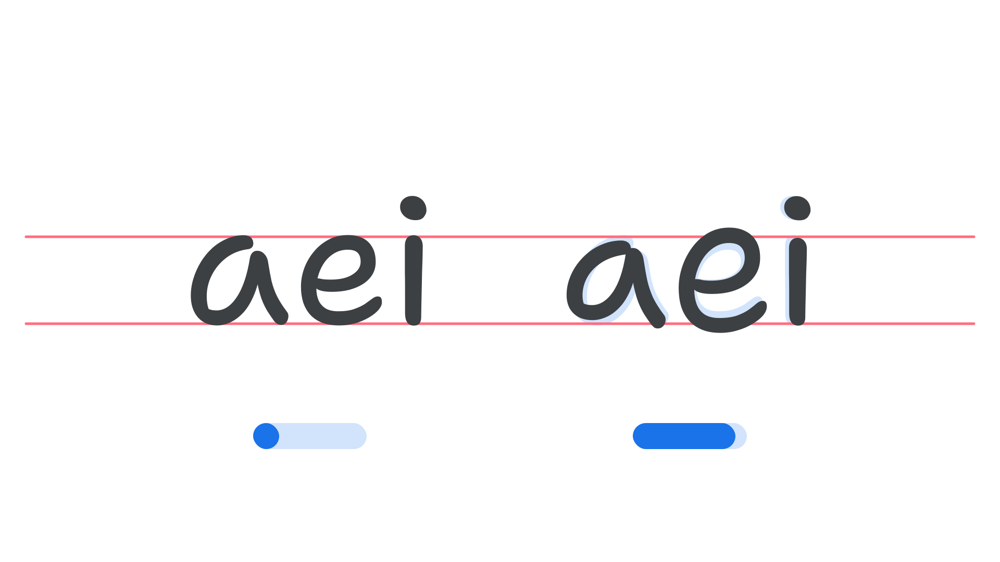

“Informality” (INFM in CSS) is an axis found in some variable fonts that can be used to introduce irregular shaping (some letters being smaller or larger than others) or adjusted proportions to mimic natural handwriting.

The [Google Fonts CSS v2 API ](https://developers.google.com/fonts/docs/css2) defines the axis as:

| Default: | Min: | Max: | Step: |
| --- | --- | --- | --- |
| 0 | 0 | 0 | 0 |

<figure>

</figure>

Note that the increased or decreased height of the letterform is context-aware, meaning that an “e”, for example, might shrink when next to some glyphs, and grow when next to others. This semi-unpredictable behaviour results in the type appearing more like handwriting, and — as with the Shantell Sans font — the effect can be further exaggerated by manipulating axes like Bounce (BNCE) and Spacing (SPAC) in tandem. 