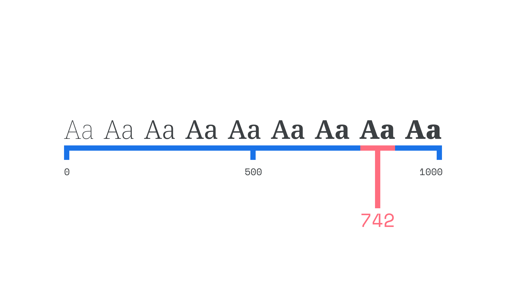

An instance is a position on a [variable font](/glossary/variable_fonts)’s [axes](/glossary/axis_in_variable_fonts), akin to the [weights](/glossary/weight) or [widths](/glossary/width) or [styles](/glossary/style) in non-variable fonts.

<figure>

</figure>

The weights and styles of a non-variable [typeface](/glossary/typeface) can be regarded as instances, too. The difference with variable fonts is that we can access all of the styles *in between* those traditional delineations. For example, if a medium weight is too light for our needs, and a bold is too heavy, then a variable font with a weight axis lets us choose from hundreds of instances in between medium and bold.

Named instances—for example, “[Recursive](https://fonts.google.com/specimen/Recursive) Light”—are fixed positions on a weight axis defined by the [type designer](/glossary/type_designer). We can jump to this instance (and therefore position on the axis), or choose to push the slider further so that the weight sits between pre-defined named instances.
