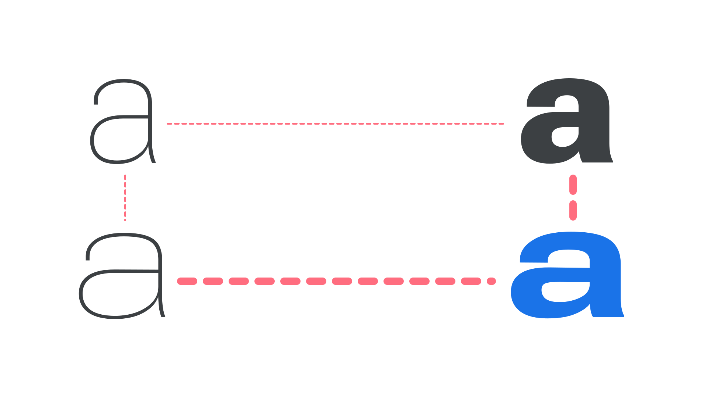

In type design, interpolation is the use of software to populate intermediate instances of a font between two masters. For instance, a light master and a bold master could be interpolated to generate a regular weight.

When a typeface has more than one axis of variation (for example, both weight and width), software can also generate a new instance in areas not covered by a specific master. This is casually referred to as interpolation, but strictly speaking it is different, as it does not occur between masters, and is technically called vector addition. For example, if one has a light master, a bold master, and a light extended master, a bold extended style could be generated by vector addition.

<figure>

<figcaption>A light master (top left), a bold master (top right), and a light extended master (bottom left) can be used to create a bold extended style (bottom right) thanks to vector addition.</figcaption>

</figure>

Interpolation and vector addition are tools type designers use to create a larger set of static fonts from fewer initial masters, and are also the mechanisms behind [variable fonts](https://fonts.google.com/knowledge/introducing_type/introducing_variable_fonts), working on-the-fly as the end user manipulates variable axes.
